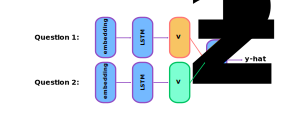

### Introducing Siamese Networks
- A siamese network is a type of neural network using two or more identical subnetworks with the same architecture
- They must share the same parameters and weights
- Implying, we only need to train one set of weights (not two)
- Typically, a siamese network is used when we're interested in determining whether two inputs are similar to each other
- The following is an example of a siamese network using an LSTM:
    - Note, not all siamese networks use an LSTM

### Interpreting the Output of Siamese Networks
- The output of a siamese network is a cosine similarity
- Meaning, the output becomes a measure of the similarity between the two inputs
- When $\hat{y}$ is less than some threshold, then the two inputs are different
- When $\hat{y}$ is greater than some threshold, then the two inputs are similar
    - Here, $\tau$ represents the threshold determining whether two inputs are similar or not
    - A larger $\tau$ implies only very similar sentences will be considered similar
    - Note, $\tau$ is a tunable hyperparameter

$$
\hat{y} \le \tau \implies \text{different}
$$

$$
\hat{y} \gt \tau \implies \text{same}
$$

### Describing Applications of Siamese Networks
- Some common applications for siamese networks include:
    - Facial recognition
    - Signature verification for banks
    - Paraphrase identification
    - Duplicate checking of two similar questions
- A siamese network performs well for tasks with little training data
    - This is because the two subnetworks have shared weights
    - Thus, there are fewer parameters to learn during training
- Specifically, siamese networks are useful when there are many classes with a small number of observations for each class

### Defining the Triplet Loss Function
- Without our training data, each observation must include a positive and negative pair
- There are three components of a triplet loss function:
    - Anchor instance
    - Positive instance
    - Negative instance
- An *anchor* refers to the input we want to test
- A *positive* example refers to saved input that's similar to the anchor
- A *negative* example refers to saved input that's different from the anchor
- The following observation satisfies the above requirements:

$$
\text{anchor} = \text{How old are you?} \\
\text{positive} = \text{What is your age?} \\
\text{negative} = \text{Where are you from?}
$$

- The triplet loss function is used to train siamese networks on training data with positive and negative pairings
- The goal of the triplet loss function is to minimize the difference of the $\text{sim}(A, N)$ and $\text{sim}(A, P)$
- When training, we should choose positive and negative examples that aren't easily discernible
- The following formula defines the triplet loss function:

$$
\text{diff} = \text{sim}(A, N) - \text{sim}(A, P) \\
\mathcal{L} = \max(\text{diff} + \alpha, 0)
$$

### Illustrating the Use of One-Shot Learning
- When we only have a few instances of each class, one-shot coding can be a useful alternative to classification problems
- For example, classifying a signature as one of the many names in our database realistically may be an infeasible solution
- Instead, we may compare the similarity of an anchor signature to positive and negative signatures already saved in our database
- This alternative process is called *one-shot learning*
- Most signature verification systems must learn from only one image
- As a result, the learning algorithm trains on a small training set
- In the case of one-shot learning, there's no longer a need for retraining our model with the addition of more signature examples

### Training an LSTM-based Siamese Network
1. Prepare the training set in the following fashion:

| Question 1          | Question 2           | Is Duplicate? |
| ------------------- | -------------------- | ------------- |
| What is your age?   | How old are you?     | true          |
| Where are you from? | Where are you going? | false         |
| ...                 | ...                  | ...           |

2. Prepare batches so each question in the other batch at its corresponding index is a duplicate:

| Batch 1             | Batch 2              |
| ------------------- | -------------------- |
| What is your age?   | How old are you?     |
| Where are you from? | Where were you born? |
| ...                 | ...                  |

3. Start with a model architecture
4. Create a siamese network consisting of two subnetworks following identical model architectures
5. Feed in two different questions from the different batches as inputs
6. Transform each question into embeddings
7. Pass the embeddings into an LSTM
8. Receive the outputs of the vectors
9. Compare these vectors using cosine similarity

### Testing an LSTM-based Siamese Network
1. Convert each input into an array of numbers
2. Feed the inputs into our model
3. Compare the outputs $v_{1}$ and $v_{2}$ using cosine similarity
4. Test against a threshold $\tau$

### References
- [Stanford Deep Learning Lectures](http://cs224d.stanford.edu/lectures/)
- [Stanford Lecture about LSTMs](http://cs224d.stanford.edu/lectures/CS224d-Lecture9.pdf)
- [Paper about Siamese Networks used in Image Recognition](https://www.cs.cmu.edu/~rsalakhu/papers/oneshot1.pdf)
- [Applications of Siamese Networks](mathworks.com/help/deeplearning/ug/train-a-siamese-network-to-compare-images.html)
- [Article about One-Shot Learning](https://bdtechtalks.com/2020/08/12/what-is-one-shot-learning/)