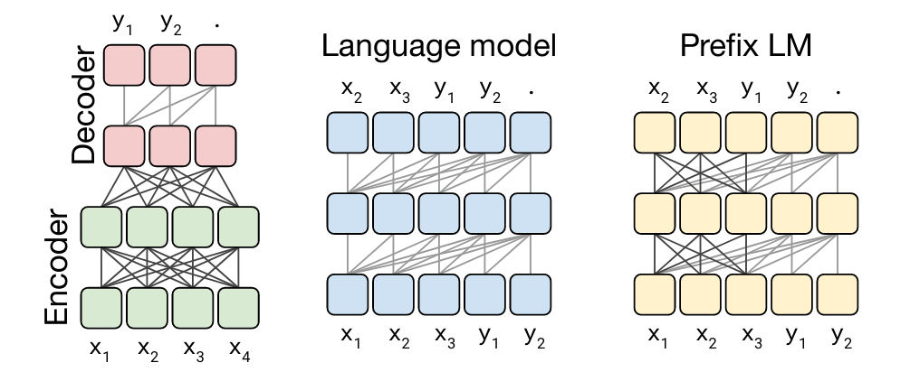

### History of BERT and Other NLP Models
- In the early stages of NLP, we simply wanted to predict the next word in a sentence
- To do this, we used a continuous bag of words (CBOW) model
    - This model is limited to classification based on the input words within a fixed-length sliding window
    - Unfortunately, this model excludes the use of many useful context words and relationships with other words in the sentence
- Then, ELMo was created in 2018 by researchers at the Allen Institute
    - This model is a bidirectional LSTM
    - Implying, words from the left and right are considered
    - This model is able to entirely capture context words and relationships
    - However, it still suffered from capturing context in longer sentences
- Later in 2018, OpenAI introduced the GPT model
    - There are $3$ versions of GPT: GPT-1, GPT-2, and GPT-3
    - All three models are a transformer model
    - This model only includes a decoder (no encoders included)
    - This model only uses causal attention
    - Unfortunately, each GPT model is only unidirectional
    - Thus, we can't capture context both leftward and rightward of our target word in a sentences
- In 2019, Google released the BERT model
    - This model is a bidirectional transformer
    - Implying, words from the left and right are considered
    - This model is able to entirely capture context words and relationships
    - This model only includes an encoder (no decoders included)
    - This model doesn't suffer from capturing context in longer sentences
    - This model can do the following tasks:
        - Next sentence prediction
        - Multi-mask language modeling:

$$
\text{... on the \_ side \_ history ... } \to \boxed{Model} \to \text{ right, of}
$$

### Introducing the T5 Model
- The T5 model could be used for several NLP tasks
- Its model (i.e. transformer) is similar to BERT
- Its pre-training (and training) strategy is similar to BERT
- Similar to BERT, it makes use of two general concepts:
    - Transfer learning
    - Mask language modeling
- T5 proposes a unified framework attempting to combine many NLP tasks into a text-to-text format
- To do this, the T5 model utilizes transfer learning
- The T5 model was trained on the $\text{C}4$ dataset
    - This data set has been open-sourced by the authors
    - It contains $750\text{GB}$ of cleaned data scraped from the internet

### Applications of the T5 Model
- Text classification
- Question answering
- Machine translation
- Text summarization
- Sentiment analysis
- And many other NLP tasks

### Formatting the Inputs of the T5 Model
- Again, the T5 model is a unified framework combining many NLP tasks into a text-to-text format
- This style of architecture differs from BERT
    - BERT is pre-trained base on the following two tasks:
        - Masked language modeling
        - Next sentence prediction
    - Meaning, it must be fine-tuned for other tasks
    - For example, we must slightly tweak the architecture if we're performing text classification or question answering
- Contrarily, the text-to-text framework suggests using the same model, loss function, and hyperparameters for every NLP task 
    - Thus, the goal of T5 is to perform any NLP task without fine-tuning
- This approach requires the inputs to be modeled so the model can recognize the task of interest
    - As a result, each input must have its task included as a prefix
- The following are examples of inputs formatted with task-prefixes:
    - Machine translation:
        - `Input:` 'translate English to Spanish: Hello!'
        - `Ouput:` 'Hola!'
    - CoLA (grammar checking):
        - `Input:` 'cola sentence: I had cat time!'
        - `Ouput:` 'unacceptable'
    - Sentiment analysis:
        - `Input:` 'sst2 sentence: I had a great time!'
        - `Ouput:` 'positive'
- Then, the output is simply the text version of the expected outcome
- The following diagram illustrates the format of the input and output: 

### Describing the Pre-Training Strategy for T5
- The T5 paper experimented with using three different architectures for pre-training:
    - Encoder-Decoder architecture
    - Language model architecture
    - Prefix language model architecture
- The encoder-decoder architecture is an ordinary encoder-decoder transformer
    - The encoder uses a *fully-visible* attention mask
    - This masking technique is also used in BERT
    - Thus, every input token contributes to the attention computation of every other input token in the input sequence
    - Then, the decoder is trained using causal attention
    - Meaning, only the previous output tokens contribute to attention computation of the current output token in the output sequence
- The language model architecture uses the attention mechanism
    - It is an autoregressive modeling approach
    - It is a mix between the the BERT architecture and language modeling approaches
- Based on various benchmarks, the best architecture is the encoder-decoder architecture

### Defining the GLUE Benchmark
- The GLUE benchmark stands for *general language understanding evaluation*
- The GLUE benchmark is one of the most popular benchmarks in NLP
- It is used to train, test, and analyze NLP tasks
- It is a collection of benchmark tools consisting of:
    - A benchmark of nine different language comprehension tasks
    - An ancillary data set
    - A platform for evaluating and comparing the models
- It is used for various types of NLP tasks:
    - Verifying whether a sentence is grammatical
    - Verifying the accuracy of sentiment predictions
    - Verifying the accuracy of paraphrasing text
    - Verifying the similarity between two texts
    - Verifying whether two questions are duplicates
    - Verifying whether a question is answerable
    - Verifying whether a question is a contradiction
- Usually, it is used with a leaderboard
    - This is so people can see how well their model performs compared to other models on a dataset
- The GLUE benchmark has the following advantages:
    - The GLUE benchmark is model-agnostic
        - Doesn't matter if we're evaluating a transformer or LSTM
    - Makes use of transfer learning
    - Most research uses the GLUE benchmark as a standard

### References
- [Stanford Deep Learning Lectures](http://cs224d.stanford.edu/lectures/)
- [Stanford Lecture about LSTMs](http://cs224d.stanford.edu/lectures/CS224d-Lecture9.pdf)
- [Lecture about the T5 Transformer](https://www.coursera.org/learn/attention-models-in-nlp/lecture/dDSZk/transformer-t5)
- [Lecture about Multi-Trask Training](https://www.coursera.org/learn/attention-models-in-nlp/lecture/vhRkb/multi-task-training-strategy)
- [Lecture about the GLUE Benchmark](https://www.coursera.org/learn/attention-models-in-nlp/lecture/h2IJz/glue-benchmark)
- [Article about the T5 Transformer Model](https://towardsdatascience.com/t5-text-to-text-transfer-transformer-643f89e8905e)
- [Description of T5 from Google AI Blog](https://ai.googleblog.com/2020/02/exploring-transfer-learning-with-t5.html)
- [Textbook Chapter about Pre-Training Strategy](https://d2l.ai/chapter_natural-language-processing-pretraining/bert.html)
- [Details about Preparing Inputs for Sentiment Analysis](https://github.com/huggingface/transformers/issues/3704)
- [List of Tasks used in T5](https://colab.research.google.com/github/PytorchLightning/pytorch-lightning/blob/master/notebooks/04-transformers-text-classification.ipynb)
- [Paper about the T5 Transformer Model](https://arxiv.org/pdf/1910.10683.pdf)
- [Paper about Alignment and Attention Models](https://arxiv.org/pdf/1409.0473.pdf)