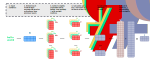

### Motivating the Transformer Model
- An RNN has $3$ problems stemming from their sequential architecture:
    - Information loss
        - Although GRU/LSTM mitigates the loss, the problem still exists
    - Suffers from the vanishing gradient problem
        - Specifically, the problem caused by longer input sequences
    - Enforces sequential processing of hidden layers
        - Parallelizing RNN computations is nearly impossible
- The more words we have in our input sequence, the more time it takes decode the sequence
    - The number of steps is equal to $T_{y}$
- Whereas, transformers support the following benefits:
    - Information loss isn't a problem
        - Since, attention scores are computed in a single step
    - Don't suffer from the vanish gradient problem
        - Specifically, the problem caused by longer input sequences
        - This is because there is only one gradient step
    - Doesn't enforce sequential processing of hidden layers
        - Parallelizing these computations is much easier
        - Since, they don't require sequential computations per layer
        - Meaning, they aren't dependent on previous layers

### Describing the Basics of a Transformer
- A transformer uses an attention mechanism without being an RNN
- In other words, it is an attention model, but is not an RNN
- A transformer processes all of the tokens in a sequence simultaneously
- Then, attention scores are computed between each token
- A transformer doesn't use any recurrent layers
- Instead, a transformer uses multi-headed attention layers

### Introducing the Architecture of a Transformer
- A transformer consists of $3$ basic components:
    - Positional encoding functions
    - Encoder
    - Decoder

### Defining Positional Encoding Functions
- An input embedding maps a word to a vector
- However, the same word in a different sentence may carry a new meaning based on its surrounding words:
    - `Sentence 1:` I love your *dog*!
    - `Sentence 2:` You're a lucky *dog*!
- This is why we use positional encoding vectors
- A positional encoding vector adds positional context to embeddings
    - It adds context based on the position of a word in a sentence

$$
PE(pos, 2i) = \sin(\frac{pos}{10000^{\frac{2i}{d_{model}}}})
$$

- Where the formula has the following variables and constants:
    - $pos$ is the position of a given word in its sentence
    - $i$ is the index of the $i^{th}$ element of the word embedding
    - $d_{model}$ is the size of the word embedding
- The following is an example of applying the positional encoding function to the $4$-dimensional word embedding of dog:

$$
\underbrace{\begin{bmatrix} 0.3 \\ 0.4 \\ 0.7 \\ 0.1 \end{bmatrix}}_{\text{embedding of dog}} + \quad \boxed{\text{positional encoding}} \; = \; \underbrace{\begin{bmatrix} 0.4 \\ 0.6 \\ 0.8 \\ 0.9 \end{bmatrix}}_{\text{positional encoding of dog}}
$$

### Initial Steps of the Encoder
- So far, we've completed the following steps, including:
    - Embedding our input
    - Performing positional encoding on the embedding
- Now, we're ready to pass the positional encoding into the encoder
- This includes performing the following specific steps:
    - Multi-head attention
    - Normalization
    - Feed-forward
- Before introducing multi-head attention, let's first start off by defining self-head attention

### Types of Attention in Neural Networks
- There are $3$ general types of attention:
    - Encoder/decoder attention
    - Causal self-attention
    - Bi-directional self-attention
- For encoder/decoder attention, a sentence from the decoder looks at another sentence from the encoder
- For causal attention, words in a sentence (from an encoder or decoder) look at previous words in that same sentence
- For bi-directional attention, words in a sentence (from an encoder or decoder) look at previous and future words in that same sentence
- Neither of these attention mechanisms are mutually exclusive
- Meaning, any attention layer can incorporate any of the $3$ types of attention

### Introducing Self-Head Attention in the Encoder
- Attention is how relevant the $i^{th}$ word in the input sequence relative to other words in the input sequence
- Self-attention allows us to associate *it* with *fruit* in the following sentence:

$$
\text{The fruit looks tasty and it looks juicy}
$$

- When calculating attention, there are $3$ components:
    - A query matrix $Q$, consisting of query vectors $q_{i}$
        - $q_{i}$ represents a vector associated with a single input word
    - A key matrix $K$, consisting of key vectors $k_{i}$
        - $k_{i}$ represents a vector associated with a single input word
    - A value matrix $V$, consisting of key vectors $v_{i}$
        - $v_{i}$ represents a vector associated with a single input word
- Specifically, each individual matrix is the result of matrix multiplication between the input embeddings and $3$ matrices of trained weights:
- These $3$ weight matrices include $W_{Q}$, $W_{K}$, and $W_{V}$
- Again, $q_{i}$, $k_{i}$, and $v_{i}$ refer to identical words of a sequence
    - However, the values associated with $q_{i}$, $k_{i}$, and $v_{i}$ are different
    - This is because $W_{Q}$, $W_{K}$, and $W_{V}$ are weight matrices learned during training
- The formulas for $q_{i}$, $k_{i}$, and $v_{i}$ are defined below:

$$
q_{1} = x_{1} \cdot W_{Q} \\
k_{1} = x_{1} \cdot W_{K} \\
v_{1} = v_{1} \cdot W_{V}
$$

- The example below has the following properties:
    - Translating a sentence with $2$ words: *hello* and *world*
    - Each word embedding vector has a length of $e_{n} = 4$
        - Implying, there are $4$ words in our vocabulary
    - Each $W_{Q}$, $W_{K}$, and $W_{V}$ is a $e_{n} \times m$ matrix
        - Where, $m$ is an adjustable hyperparameter
        - For now, we'll decide to assign $m = 3$
    - Each $q_{i}$, $k_{i}$, and $v_{i}$ has a length of $m$

- Notice, $q_{1}$ is the result of multiplying $x_{1}$ and $W_{Q}$ together
- Notice, $k_{1}$ is the result of multiplying $x_{1}$ and $W_{K}$ together
- Notice, $v_{1}$ is the result of multiplying $x_{1}$ and $W_{V}$ together

### Steps for Calculation Self-Attention in the Encoder
- At a high level, a self-attention block does:
    1. Start with trained weight matrices $W_{Q}$, $W_{K}$, and $W_{V}$
    2. Compute embeddings to determine how similar $X$ or previous activations are to input words and output words
        - Roughly, $Q$ represents *embeddings* of output words
        - Roughly, $K$ and $V$ represent *embeddings* of input words
        - In other words, $Q$ learns patterns from our output sentence
        - And, $K$ and $V$ learns patterns from our input sentence
    3. Convert these similarity scores to probabilities
        - This is because probabilities are easier to understand
- At a lower level, a self-attention block does:
    1. Receives trained weight matrices $W_{Q}$, $W_{K}$, and $W_{V}$
    2. Computes $Q$, $K$, and $V$:
        - $Q = X \cdot W_{Q}$
        - $K = X \cdot W_{K}$
        - $V = X \cdot W_{V}$
    3. Computes alignment scores by $q_{i} \cdot k_{j}$
        - Here, we're looking for keys $k_{j}$ (input words) that are similar with our query $q_{i}$ (output word)
    4. Divide alignment scores by $\sqrt{d_{k}} = \sqrt{4}$ for more stable gradients
    5. Pass values from our previous step through a softmax function
        - This formats each alignment score as a probability
    6. Compute dot product of $v_{i} \cdot \text{softmax value}$ to get $Z$ matrix
        - Here, $Z$ represents our attention scores
        - Roughly, $V$ represents how similar words from $Q$ and $K$ are
        - Multiplying softmax values by $V$ represents weighting each value $v_{j}$ by the probability that $k_{j}$ matches the query $q_{i}$

### Understanding Dimensions of $Q$, $K$, and $V$
- Suppose we're translating an English sentence to a German sentence
- $Q$ has the following dimensions:
    - Number of rows $=$ number of words in the German sentence $L_{Q}$
    - Number of columns $=$ a proposed length $D$ of the embedding
- $K$ has the following dimensions:
    - Number of rows $=$ number of words in the English sentence $L_{K}$
    - Number of columns $=$ a proposed length $D$ of the embedding
- $V$ has the following dimensions:
    - Number of rows $=$ number of words in the English sentence $L_{K}$
    - Number of columns $=$ a proposed length $D$ of the embedding
- $A=\text{softmax}(QK^{T})$ has the following dimensions:
    - Number of rows $=$ number of words in the German sentence $L_{Q}$
    - Number of cols $=$ number of words in the English sentence $L_{K}$
- $Z=AV$ has the following dimensions:
    - Number of rows $=$ number of words in the German sentence $L_{Q}$
    - Number of columns $=$ a proposed length $D$ of the embedding
- Here, $D$ is an adjustable hyperparameter
- Mathematically, these matrices are denoted as the following:

$$
Q: L_{Q} \times D \\
K: L_{K} \times D \\
V: L_{K} \times D \\
A: L_{Q} \times L_{K} \\
Z: L_{Q} \times D
$$

### Calculating Self-Attention in the Encoder
- $q_{i}$, $k_{i}$, and $v_{i}$ are simply abstractions that are useful for calculating and thinking about attention
    - However, they are not attention scores themselves
    - Each row of $Q$, $K$, and $V$ are associated with an input word
    - Meaning, $q_{i}$, $k_{i}$, and $v_{i}$ refer to the $i^{th}$ input word
- For now, let's focus on calculating the attention scores for the first word $x_{1}$ relative to the other words in the sentence (i.e. $x_{2}$)
- To calculate attention scores, we just take the dot product of $q_{i} \cdot k_{j}$
    - This determines how relevant word $q_{i}$ is to word $k_{j}$
- The following diagram illustrates computing attention scores for:
    - $q_{1}$ and $k_{1}$
    - $q_{1}$ and $k_{2}$

- Next, we'll normalize the attention scores by:
    1. Dividing them by $\sqrt{d_{k}}$
        - This leads to having more stable gradients
    2. Then, passing those outputs through the softmax function
        - The softmax function formats values as probabilities
        - Thus, the output determines how much each word will be expressed for this input word $x_{1}$
    3. Computing the dot product of the softmax value and each $v_{i}$
        - This keeps relevant words and drowns out irrelevant words

- The steps can be condensed using matrix multiplication
- Thus, each row of $Z$ is a vector for each word
- Again, $Z$ represents the attention scores
- The following computes self-attention on $x_{1}$ and $x_{2}$:

### Improving Self-Attention with Multi-Headed Attention
- The transformer paper refined the self-attention layer by adding a mechanism called *multi-headed* attention
- This improves the accuracy and performance of self-attention:
    - `Accuracy:` Different sets of $Q_{h}$, $K_{h}$, and $V_{h}$ can learn different contexts and patterns in the sentence
        - We'll know *it* refers to *fruit* here:
        $$
        \text{The fruit looks tasty and it looks juicy}
        $$
    - `Performance:` Simply splitting $Q$, $K$, and $V$ into smaller *heads* allows us to parallelize matrix multiplication and other computations on these heads 
- Without using multi-headed attention, self-attention will weight always assign the most attention to itself
    - Consequently, it becomes useless
    - Which is why we include $8$ different sets of heads
    - Then, we'll be able to pick up on more interesting contexts
- Although additional sets of queries/keys/values are added, they can be processed in parallel with each other
- The number of sets of queries/keys/values are determined by the number of attention heads
    - This number is an adjustable hyperparameter
    - For future examples, we'll assign this number $h=8$, since this is the default number specified in the transformer paper
- The mult-headed attention mechanism follows the same steps as the steps in self-attention
- However, multi-headed attention layer makes a few adjustments:
    1. Receives trained weight matrices $W_{Q}$, $W_{K}$, and $W_{V}$
    2. Compute $h=8$ sets of $Q$, $K$, and $V$:
        - $Q = X \cdot W_{Q}$
        - $K = X \cdot W_{K}$
        - $V = X \cdot W_{V}$
    3. Computes attention scores by $q_{i} \cdot k_{j}$
    4. Divide attention scores by $\sqrt{d_{k}} = \sqrt{4}$ for more stable gradients
    5. Pass the values in the previous step through the softmax function
    6. Compute dot product of $v_{i} \cdot \text{softmax value}$ to get $Z$ matrix
    7. Stack the $8$ $Z$ matrices together
    8. Multiply stacked $Z$ matrix by another trained $W_{O}$ matrix $Z \cdot W_{O}$ to get $Z_{final}$

### Defining the Masked Multi-Headed Attention Blocks
- The masked multi-headed attention block is essentially the same as an attention block
- However, the decoder must receive the information from the encoder
- Otherwise, we wouldn't have learned anything from the encoder
- Therefore, the masked multi-headed attention block receives:
    - `Information from encoder:` all of the words from the english sentence
    - `Information from previous decoder layers:` previous words in the translated sentence 
- Thus, the masked multi-headed attention block *masks* upcoming words in the translated sentence by replacing them with $0$
- Then, the attention network won't use them

### Training Multi-Headed Attention Blocks
- $Q$, $K$, and $V$ are trained and used in the encoder's multi-headed attention block
- Then, $K$ and $V$ are passed to the decoder's masked multi-headed attention block
    - In the multi-headed attention block, its own individual $Q$ is trained
- Lastly, the same $K$ and $V$ are passed again to the decoder's second multi-headed attention block
    - The masked multi-headed attention block passes its $Q$ to this multi-headed attention block
- This is a crucial step in explaining how the representation of two languages in an encoder are mixed together
- In summary, there are $2$ $Q$ matrices trained
    - One $Q$ is trained and used in the encoder
    - Another $Q$ is trained and used in the decoder
- And, there is only $1$ $K$ and $1$ $V$ matrix trained
    - They are trained and used in the encoder and decoder

### Illustrating Multi-Headed Attention after Training
- After calculating each of the $8$ heads, we can refer to the attention heads relative to individual words to determine what each head focuses on
- In the following example, we encode the word *it*
- Notice, one attention head focuses most on *the animal*
- Another attention head focuses on *tired*
- In a sense, the model's representation of the word *it* bakes in some of the representation of both *animal* and *tired*

- In the above example, notice how we're only focused on the $2^{nd}$ and $3^{rd}$ heads
- By comparing particular heads with each other, we can get a decent idea about what other words each head focuses on relative to an individual word
- Notice, if we focus on all of the heads, any analysis becomes less interpretable:

### Illustrating the Encoder and Decoder during Training
- The input of the encoder is an input sequence
- The output of the encoder is a set of attention vectors $K$ and $V$
- These $2$ matrices are used by the decoders in its attention layers
- This helps the decoder focus on appropriate places in the input sequence
- Refer [here](http://jalammar.github.io/illustrated-transformer/) for more detailed illustrations of the encoder and decoder

### Applications of a Transformer Model
- Automatic text summarization
- Auto-completion
- Named entity recognition (NER)
- Question answering
- Machine translation
- Chat bots
- Sentiment analysis
- Market intelligence
- Text classification
- Character recognition
- Spell checking

### Popular Types of Transformers
- GPT-3
    - Stands for *generative pre-training for transformer*
    - Created by OpenAI with pre-training in 2020
    - Used for text generation, summarization, and classification
- T5
    - Stands for *text-to-text transfer transformer*
    - Created by Google  in 2019
    - Used for question answering, text classification, question answering, etc.
- BERT
    - Stands for *bidirectional encoder represeentations from transformers*
    - Created by Google in 2018
    - Used for created text representations

---

### tldr
- The positional encoding vectors find patterns between positions of words in the sentences
- The attention layers find patterns between words in the sentences 
- Normalization helps speed up training and processing time
- Multi-headed attention layers only involve to matrix multiplication operations
- Multi-headed attention improves both performance and accuracy:
    - `Accuracy:` More heads imply more detectable patterns between words
    - `Performance:` These heads can be computed and trained in parallel using GPUs
- Multi-headed attention scores are formatted as probabilities using the softmax function
- The fully connected feed-forward layer in the encoders and decoders are trained using ReLU activation functions
- Roughly, $Q$ represents *embeddings* of output words
    - $Q$ learns patterns from our output sentence
- Roughly, $K$ and $V$ represent *embeddings* of input words
    - $K$ and $V$ learns patterns from our input sentence
    - $V$ represents how similar words from $Q$ and $K$ are
- The encoder and decoder use the same $K$ and $V$
- The encoder and decoder has its own $Q$

---

### References
- [Stanford Deep Learning Lectures](http://cs224d.stanford.edu/lectures/)
- [Stanford Lecture about LSTMs](http://cs224d.stanford.edu/lectures/CS224d-Lecture9.pdf)
- [Lecture about Self-Attention in NLP](https://www.coursera.org/learn/attention-models-in-nlp/lecture/lO5yN/dot-product-attention)
- [Lecture about Multi-Headed Attention in NLP](https://www.coursera.org/learn/attention-models-in-nlp/lecture/K5zR3/multi-head-attention)
- [Lecture about Types of Attention in NLP](https://www.coursera.org/learn/attention-models-in-nlp/lecture/AMz8y/causal-attention)
- [Defining the Use and Architecture of Transformers](https://www.youtube.com/watch?v=TQQlZhbC5ps)
- [Illustrating the Architecture of Transformers](http://jalammar.github.io/illustrated-transformer/)
- [Paper about Transformer Models](https://arxiv.org/pdf/1706.03762.pdf)
- [How Attention is Calculated During Training](https://ai.stackexchange.com/a/20178)
- [Intuition behind Positional Encoding Vectors](https://kazemnejad.com/blog/transformer_architecture_positional_encoding/)
- [Post about Positional Encoding Vectors](https://datascience.stackexchange.com/a/51225)
- [Post about Attention Mechanism](https://ai.stackexchange.com/a/21404)
- [Detailed Description about Self-Attention](https://datascience.stackexchange.com/a/66431)
- [Paper about Alignment and Attention Models](https://arxiv.org/pdf/1409.0473.pdf)