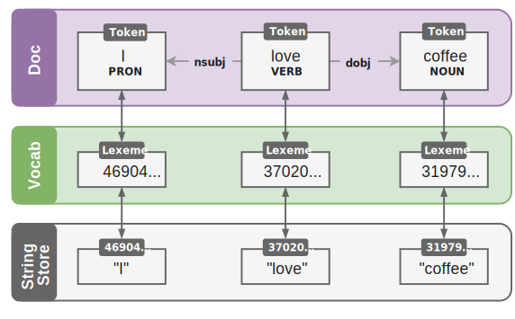
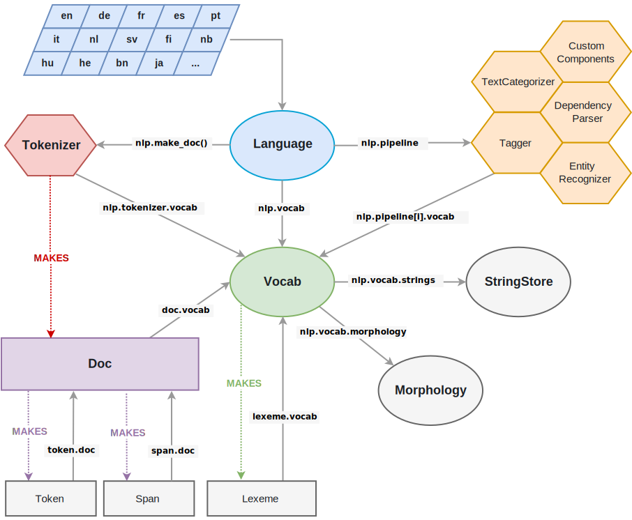

### More Spacy Objects
- The `Token` object is a word, punctuation mark, etc.
- The `Doc` object owns the sequence of tokens and all their annotations
- The `StringStore` object is a dictionary mapping hash values to strings
- In other words, a `StringStore` object is a lookup table for hases and their string values
- The `Vocab` object is a set of `Lexeme` objects
- The `Lexeme` object is the hash value that represents the context-independent information about a word
- For example, no matter if *love* is used as a verb or a noun in some context, its spelling and whether it consists of alphabetic characters won't ever change
- Its hash value will always be the same

### Summarizing the Spacy Architecture
- The `Doc` objects owns the data
- The `Span` and `Token` are views that point into the `Doc` object
- The `Doc` object is constructed by the `Tokenizer`
- After the `Doc` object is created, it is modified in place by the components of the pipeline
- The `Language` object coordinates these components
- Specifically, it takes raw text and sends it through the pipeline, returning an annotated document
- It also orchestrates training and serialization

### References
- [Spacy Architecture](https://spacy.io/usage/spacy-101#architecture)
- [Spacy Architecture from the API](https://spacy.io/api)
