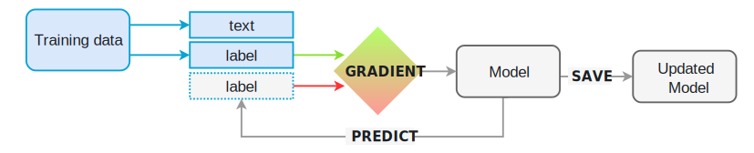

### Motivating Model Training
- Spacy's models are *statistical* and every decision they make is a prediction
- This prediction is based on the examples the model has seen during training
- To train a model, we first need training data
- This could be a part-of-speech tag, a named entity, or any other information



### Training with Annotations
- The `GoldParse` object is a collection of specified annotations for some given training examples
- These annotated training examples are called the *gold standard*
- A `GoldParse` object is initialized using the `Doc` object
- Specifically, the `GoldParse` object refers to the labels for some unlabeled training data
- Here's an example of a simple `GoldParse` for part-of-speech tags:

```python
>>> vocab = Vocab(tag_map={"N": {"pos": "NOUN"},
...                        "V": {"pos": "VERB"}})
>>> doc = Doc(vocab, words=["I", "like", "stuff"])
>>> gold = GoldParse(doc, tags=["N", "V", "N"])
```

### References
- [Basics of Training Spacy Models](https://spacy.io/usage/training#basics)
- [GoldParse Class](https://spacy.io/api/goldparse)
