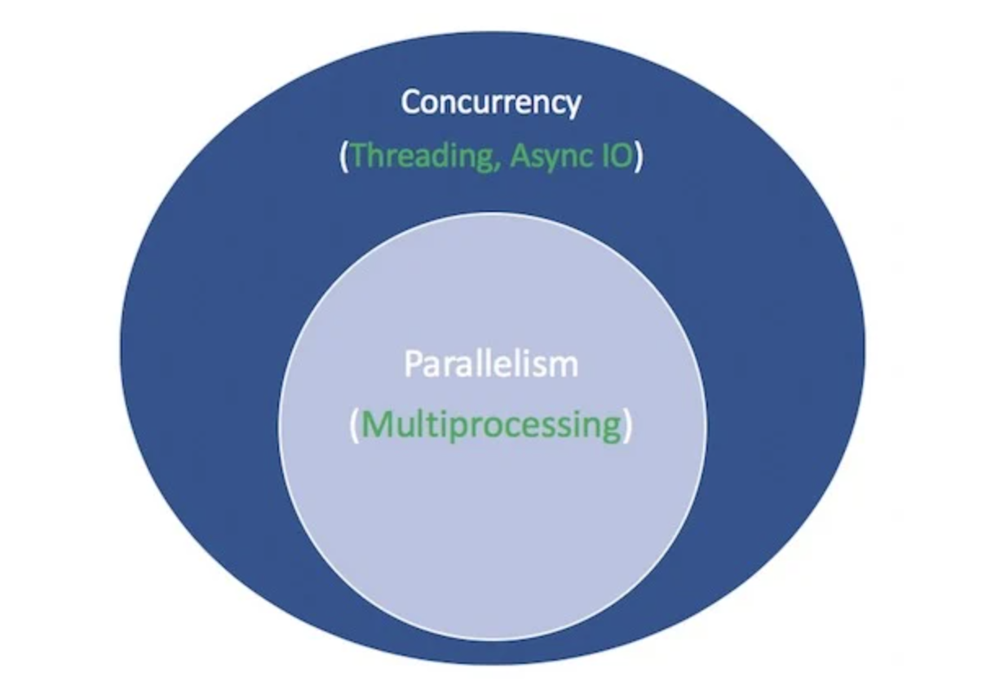

### Motivating the Use of Asyncio
- Asyncio is a library used for writing asynchronous code
	- Asynchronous code is a form of concurrent code
- Asyncio uses coroutines for asynchronous programming
- Asynchronous programming has the following properties:
	- Asynchronous routines can be paused
	- Asynchronous routines can be resumed
- Other routines can be run while routines are paused
- In the following diagram:
	- White terms represent concepts
	- Green terms represent implementations of those concepts

### Illustrating Async Code with a Chess Analogy
- Asyncio may seem counterintuitive
- Specifically, how can asyncio
	- Use a single thread
	- And a single CPU core
	- And be concurrent
- Suppose we play in a chess exhibition
- Specifically, we play multiple amateur players
- There are two ways of conducting the exhibition:
	- Synchronously
	- Asynchronously
- In the chess exhibition, let's assume the following:
	- There are $24$ opponents
	- Each move only takes us $5$ seconds
	- Each move takes $55$ seconds for each of our opponents
	- There are $30$ pair-moves on average ($60$ moves in total)

### Synchronously Playing Chess
- We complete one game at a time
- We never play two games at the same time
- Each game takes $30$ minutes:

$$
(55+5) \times 30 = 1800 \text{ seconds} = 30 \text{ minutes}
$$

- The entire exhibition takes $12$ hours:

$$
24 \times 30 = 720 \text{ minutes} = 12 \text{ hours}
$$

### Asynchronously Playing Chess
- We move from table to table
- We make one move at each table
- Our oppenent needs time to respond to our move
- They need some time to think
- In the mean time, we move to another opponent and return when they've made their move
- One move across all $24$ games takes us $2$ minutes

$$
24 \times 5 = 120 \text{ seconds} = 2 \text{ minutes}
$$

- The entire exhibition is now cut down to $1$ hour

$$
120 \times 30 = 3600 \text{ seconds} = 1 \text{ hour}
$$

### The History of `async` and `await`
- **3.3:** The `yield from` allows for generator delegation
- **3.4:** asyncio was introduced
	- It was added to the Python standard library
	- It was considered very unstable at this time
- **3.5:** `async` and `await` were included in the Python grammar
	- They were used to signify and wait on coroutines
	- They were not yet reserved keywords
	- For example, custom functions and variables still could be named `async` and `await`
- **3.6:** Asynchronous generators were introduced
	- Asyncio was considered stable
- **3.7:** `async` and `await` became reserved keywords
	- They could not be used as identifiers
	- They replaced the `asyncio.coroutine()` decorator
	- `asyncio.run()` was introduced to the asyncio package

### References
- [Brief Description of Event Loops in Asyncio](https://realpython.com/python-concurrency/#asyncio-version)
- [Walkthrough of Asyncio API](https://www.integralist.co.uk/posts/python-asyncio/)
- [Details about Chaining Coroutines](https://python.readthedocs.io/fr/latest/library/asyncio-task.html#example-chain-coroutines)
- [Asyncio Documentation about Coroutines and Tasks](https://docs.python.org/3/library/asyncio-task.html)
