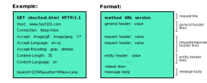

### Describing the Format of HTTP Requests
- An HTTP client sends an HTTP request to a server
- An HTTP request maintains the following format:
	- A request line
	- Zero or more header lines
		- Including general, request, and entity fields
	- An empty line
	- Optional message body

### Describing the Format of HTTP Responses
- First, a server receives a HTTP request message
- Then, that server responds with an HTTP response message
- HTTP responses maintain a similar format as HTTP requests
- They maintain the following format:
	- A request line
	- Zero or more header lines
	- An empty line
	- Optional message body

### Components of HTTP Requests and Responses
- `Request Line:` Contains:
	- A request method
	- A URL of the desired resource
- `General Header:` General info about a request or response
- `Entity Header:` Info about the resource of a request
- `Request Header:` Information about the client
- `Response Header:` Information about the server
- `Message Body:` Data meant for the client or server recipient
- An HTTP request has a request header
- An HTTP response has a response header
- A typical request looks like the following:



### Defining HTTP Request Methods
1. **GET** Method
	- This method is given a server URI
	- This method is used to retrieve information from this server
	- Specifically, this method should only *retrieve* data
	- It should not have any other effect on the data
2. **HEAD** Method
	- This method is also given a server URI
	- It is also used to retrieve information from this server
	- However, it returns the status line and header section only
3. **POST** Method
	- This method is used to send date to a server
	- This method represents an addition of data
	- For example, this data could include:
		- Customer information
		- File uploads
		- Data from HTML files
4. **PUT** Method
	- This method is used to replace data from a server
	- Specifically, it replaces this data with a given resource
	- The target resource is given by a URI
	- This method represents a replacement of data
5. **DELETE** Method
	- This method is used to remove data from a server
	- Specifically, the target resource is given by a URI
	- The target resource is removed from the server
6. **CONNECT** Method
	- This method is used to establish a tunnel to the server
	- Specifically, the server is identified by a given URI
7. **OPTIONS** Method
	- This method is used to describe the options of communication for the target resource
8. **TRACE** Method
	- This method is used to perform a message loop-back test to a target resource

### Examples of HTTP Requests
1. **GET** Method

```
GET /test.html HTTP/1.1
Host: www.test101.com
Accept: image/gif, image/jpeg, */*
Accept-Language: en-us
Accept-Encoding: gzip, deflate
User-Agent: Mozilla/4.0
Content-Length: 35

bookId=12345&author=Mike+Lane
```

2. **HEAD** Method

```
HEAD /test.html HTTP/1.1
Host: www.test101.com
Accept: image/gif, image/jpeg, */*
Accept-Language: en-us
Accept-Encoding: gzip, deflate
User-Agent: Mozilla/4.0
Content-Length: 35

bookId=12345&author=Mike+Lane
```

3. **POST** Method

```
POST /bin/login HTTP/1.1
Host: www.test101.com
Accept: image/gif, image/jpeg, */*
Accept-Language: en-us
Accept-Encoding: gzip, deflate
User-Agent: Mozilla/4.0
Content-Length: 35

User=Peter+Lee&pw=123456&action=login
```

4. **PUT** Method

```
PUT /new.html HTTP/1.1
Host: www.test101.com
Accept: image/gif, image/jpeg, */*
Accept-Language: en-us
Accept-Encoding: gzip, deflate
User-Agent: Mozilla/4.0
Content-Length: 31
Content-type: text/html

<p>New File</p>
```

5. **DELETE** Method

```
DELETE /file.html HTTP/1.1
```

6. **CONNECT** Method

```
CONNECT server.example.com:80 HTTP/1.1
Host: server.example.com:80
Proxy-Authorization: basic aGVsbG86d29ybGQ=
```

7. **OPTIONS** Method

```
OPTIONS /resources/post-here/ HTTP/1.1
Host: bar.other
Accept: text/html,application/xhtml+xml,application/xml;q=0.9,*/*;q=0.8
Accept-Language: en-us,en;q=0.5
Accept-Encoding: gzip,deflate
Accept-Charset: ISO-8859-1,utf-8;q=0.7,*;q=0.7
Connection: keep-alive
Origin: http://foo.example
Access-Control-Request-Method: POST
Access-Control-Request-Headers: X-PINGOTHER, Content-Type
```
8. **TRACE** Method

```
TRACE /index.html
```

### Defining HTTP Response Codes
- HTTP response codes indicate the status of an HTTP request
- These responses are grouped into five classes:
	1. `Informational Responses:` 100-199 codes
		- The request was received and the process is continuing
	2. `Successful Responses:` 200-299 codes
		- The action was successfully received and understood
	3. `Redirectional Responses:` 300-399 codes
		- The action must be continued to complete the request
	4. `Client Errors:` 400-499 codes
		- The request contains incorrect syntax
	5. `Server Errors:` 500-599 codes
		- The server failed to fulfill any request

### References
- [Basics of HTTP Methods](https://www.ntu.edu.sg/home/ehchua/programming/webprogramming/http_basics.html)
- [Examples of HTTP Requests](https://developer.mozilla.org/en-US/docs/Web/HTTP/Methods)
- [Description of HTTP Request Methods](https://www.tutorialspoint.com/http/http_requests.htm)
- [Description of HTTP Response Methods](https://www.tutorialspoint.com/http/http_responses.htm)
- [List of HTTP Response Codes](https://developer.mozilla.org/en-US/docs/Web/HTTP/Status)
- [Definition of Request Headers](https://www.w3.org/Protocols/rfc2616/rfc2616-sec5.html#sec5.3)
- [Definition of Response Headers](https://www.w3.org/Protocols/rfc2616/rfc2616-sec6.html#sec6.2)
- [Definition of General Headers](https://www.w3.org/Protocols/rfc2616/rfc2616-sec4.html#sec4.5)
- [Definition of Entity Fields](https://www.w3.org/Protocols/rfc2616/rfc2616-sec7.html#sec7.1)
