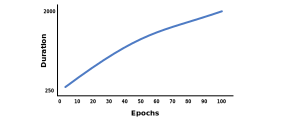

Since [ALS was used](http://www.yifanhu.net/PUB/cf.pdf) by researchers at Yahoo in $2008$, more recommenders have been developed to handle implicit data interactions. Many of these recommenders are based on matrix factorization and still suffer from the cold-start problem, which refers to the inability to make predictions about new customers or new items, without being forced to retrain the entire model. I've seen many different varients of the cold-start problem in different blogs and papers, but this seems to be the most prevalent definition.

Content-based models, like decision trees or clustering models, often don't experience the cold-start problem, since only the features of a new user are necessary for these models to make predictions (rather than the user ID itself). On the other hand, collaborative filtering models often are incapable of modeling a new or recently added user, since the whole model must be retrained for the collaborative filtering model to look up that user by his or her ID. For this reason, these collaborative filtering models aren't really considered to be *model-based* and instead are considered to be *memory-based*. For a more detailed evaluation of recommenders' behaviors, refer to [this paper](https://dl.acm.org/doi/10.1145/2645710.2645742), which was published and presented at the [RecSys 2014 Conference](https://recsys.acm.org/recsys14/).

For the remainder of this post, I plan on illustrating the major similarities and differences between some of the most common implicit recommendation algorithms found in practice.

## Comparing the ALS and BPR Losses

In practice, there are two major differences I've found between using ALS and BPR. Obviously, these differences exist because of their distinct loss functions. The first major difference relates to the ranking of items for a user based on its ratings (or relevance scores), and the second major difference relates to transfer learning happening across similar users and items built into the ratings. Note, most of the following points come from my practical experience with these recommenders, so these points may or may not perfectly align with today's literature or any future literature.

Again, the first difference between the two models relates to the degree to which a user's ranking between rated items is maintained for predicted ratings. The second difference relates to the amount of accurate *transfer learning* that is happening between similar items and users when ratings are predicted. When referring to collaborative filtering models, [transfer learning](https://arxiv.org/pdf/1507.08439.pdf) typically refers to the degree to which a user's predicted rating for an item is based on information from other similar users and similar items. In general, models using the BPR loss function have a greater degree of transfer learning built into the predicted ratings, compared to models using the ALS loss function.

Now, let me expand on the first difference relating to ranking. ALS creates latent factors that will map back to the original rating matrix as accurately as possible, whereas BPR creates latent factors that will make sure the ranking of items for each user is maintained when mapped back to the original rating matrix. For example, let's say there is a user who gives item A a $5.0$ star rating and item B a $4.8$ star rating. Notice, this user's first and second top-rated items are close to each other in this example. ALS is more likely to create embeddings that could jumble up the ranking of these ratings, meaning the predicted rating could be $4.7$ stars for item A and $4.9$ stars for item B after the ALS embeddings are multipled together. However, BPR is more likely to create embeddings that would maintain the correct ranking of these ratings. So, the predicted rating could be $4.3$ stars for item A and $3.9$ stars for item B after the BPR embeddings are multipled together. Notice, the ranking is maintained using the BPR embeddings, but the user's ratings are more accurate using the ALS embeddings.

As with other recommenders, the BPR model can sometimes fall into a feedback loop of just recommending the most popular item. For example, BPR is more prone to recommend the most popular item if most users highly rate the most popular item and if the total number of available items is small. This point is illustrated in the example below recommending food at a completely fictional Chinese restaurant. In other words, I've noticed there is a lesser degree of newness or diversity with predicted ratings from a BPR model compared to an ALS model, since the actual item ranking is maintained much more often with a BPR model. This is a direct effect of the BPR loss function optimizing for an accurate ranking of ratings. 

Now, let's expand on the second difference relating to transfer learning, which is actually a direct effect of the first difference (i.e. opimizing for more accurate ranking).  According to [the BPR paper](https://arxiv.org/pdf/1205.2618.pdf), the model assumes that a user prefers their observed items (i.e. rated, purchased, viewed, etc.) over any unobserved items (i.e. items without a rating, purchase, view, etc.). For a user's unobserved items, the BPR model predicts ratings that more accurately reflect the items of similar users.

As an example, suppose most users who watch horror movies also watch documentaries, and suppose we notice a particular user has only ever watched horror movies. In this situation, there is a better chance of our BPR model predicting ratings, such that horror movies are ranked the highest and documentaries are ranked the next highest on average. On the other hand, our ALS model doesn't guarantee that documentaries are ranked the next highest. This point is especially true when the ranking of items are somewhat close together. For example, suppose users who watch horror movies nearly watch action movies as often as documentaries, but still not quite as often as documentaries. Then, ALS has a better chance of jumbling up these rankings by predicting ratings that rank action movies slightly higher than documentaries for users who watch horror movies. The reason for this happening is because BPR optimizes for accurate rankings of ratings, whereas ALS optimizes for accurate ratings. 

## Comparing the BPR and WARP Losses

The BPR and WARP loss functions originate from information retrieval theory and have been used in Learning to Rank (LTR) models. BPR focuses on running pairwise comparisons between samples of positive and negative items. More specifically, a BPR model involves selecting a user $u$ and an item $i$ that user $u$ deems to be positive, which could mean the user viewed the item, purchased the item, rated highly, etc. Then, BPR models will randomly select an item $j$ that the same user $u$ deems to be negative. Once the BPR model has randomly selected a positive item $i$ and negative item $j$, it computes a predicted rating for both items by calculating the dot product of its factorized item vectors on the user vector. Meaning, the BPR model will calculate the dot product between the factorized vectors user $u$ and item $i$, and it will calculate the dot product between user $u$ and item $j$.

Lastly, the BPR model calculates the difference between those two predicted ratings and passes this difference through a sigmoid function. This final output is used as a weighting coefficient to update all of the model parameters using stochastic gradient descent (or SGD). Essentially, the output of the sigmoid function represents the rank of each item relative to a user, and it tells us how close or far away one item's rating is to another item's rating. In summary, we only focus on the relative ranking between items for a user, and we completely disregarded how well we predict the rating for each user-item pair.

In a similar fashion, WARP focuses on the ranking of items for each user by using a triplet loss $(user, positive item, negative item)$, like BPR. However, the WARP loss function only updates parameters when the model predicts a negative item has a higher score than the positive item, whereas the BPR loss function updates parameters for every iteration. When iterating, the WARP loss function continues to draw negative samples until it finds a rank violation or hits some assigned threshold given as a hyperparameter. In the initial iterations, WARP makes a larger gradient update for any rank violations, indicating predictions aren't an accurate reflection of the actual ranking of items for a user. In later iterations, WARP makes smaller updates for any rank violations, since this indicates the model is producing predictions that are a more accurate reflection of the actual ranking of items. In other words, the model's predictions provide an optimal accuracy, so updates should be small.

Compared to the BPR loss function, the WARP loss function generally produces more accurate predictions (in terms of ranking), but takes more time to train since it continues to sample items until a rank violation appears. Consequently, as more epochs (or iterations) are trained, the WARP loss functions becomes much slower compared to the BPR loss function, since a violation becomes more difficult to find. Assigning a cutoff value for searching is important for training using the WARP loss function.

Most of the information comparing the BPR and WARP loss functions came from [this research paper](https://sites.northwestern.edu/msia/2019/04/24/personalized-restaurant-recommender-system-using-hybrid-approach/). It references the [LightFM paper](https://arxiv.org/pdf/1507.08439.pdf) occasionally, which is a hybrid recommender that can use both the BPR and WARP loss functions. I recommend reading the LightFM paper for a better understanding of contextual models, the BPR loss function, and the ALS loss function. I recommend reading the research paper for a better understanding of the BPR and WARP loss functions.