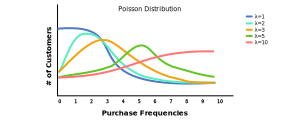
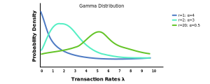
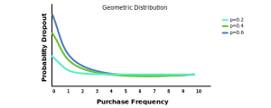

In [many of Peter Fader's presentations](https://www.youtube.com/watch?v=guj2gVEEx4s), he has demonstrated how LTV forecasts can be accurately estimated by modeling and comining two other estimates together. In particular, these two models refer to a purchase frequency model, which estimates the frequency of orders a customer will make, and a spend model, which estimates the dollar amount a customer will make. This post specificially deals with defining the former model, which is outlined in [Peter Fader's paper](http://brucehardie.com/papers/018/fader_et_al_mksc_05.pdf) from 2005.

This model is referred to as the *Buy till you die* (or [BTYD](https://en.wikipedia.org/wiki/Buy_Till_you_Die)) class of statistical models, which are designed to capture the purchasing behavior of non-contractual customers. Interestingly, the purchasing behavior of non-contractual customers can be summarized using two sub-models only.

The Beta-Geometric/Negative-Binomial-Distribution (or BG/NBD) model is the most popular example of a BTYD model, which estimates the purchase frequency of customers. Specifically, this BTYD model jointly models two different things:
1. How frequently customers make purchases while they're still *alive*
2. How likely customers are to churning in a given time period

In particular, the former process models the *repeat purchasing* of customers, while the latter process models the *dropout rate* of customers. The BG/NBD model will model the repeat purchasing process as an NBD (or poisson-gamma mixture) model, and it will model the dropout rate process as an BG (or beta-gamma mixture) model.

The *Buy* part (in the BTYD) refers to the frequency of orders made by each customer. Mathematically, the frequency of orders made by each customer is poisson-distributed across the entire population of customers. This distribution is parameterized by $\lambda$, which represents the expected *transaction rate* made across the entire population of customers for a given time period.

The expected transaction rate comes from an underlying data-generating process representing the entire population of customers. The expected transaction rate for customers is gamma-distributed across the entire population of customers. Said another way, heterogeneity in $\lambda$ follows a gamma distribution. Implying, most customers have small transaction rates, which typically represent the lower valued customers. Some customers have larger transaction rates, which usually represent the higher valued customers. The shape of the gamma distribution (representing customer transaction rates) is defined using $r$ and $\alpha$ parameters. Here, $r$ is known as the shape parameter, whereas $\alpha$ is known as the scale parameter.

The *Till you die* part (in the BTYD) refers to the dropout rate for each customer. Mathematically, the dropout rate for each customer is geometric-distributed across the entire population of customers. This distribution is parameterized by $p$, which represents the expected dropout rate made across the entire population of customers in a given time period.

The expected dropout rate comes from an underlying data-generating process representing the entire population of customers. The expected dropout rate for customers is geometric-distributed across the entire population of customers. Said another way, heterogeneity in $p$ follows a geometric distribution. Implying, customers having only made one order have a higher chance of churning, which typically represents the lower valued customers. On the other hand, customers having made multiple orders have a lower chance of churning, which usually represent the higher valued customers. The shape of the distribution representing customer dropout rates is represented using $s$ and $\beta$ parameters. Here, $s$ is known as the shape parameter, whereas $\beta$ us known as the scale parameter.

For more information about the BG/NBD model or other BTYD models, refer to [Peter Fader's original paper](http://brucehardie.com/papers/018/fader_et_al_mksc_05.pdf). For higher-level illustrations about the BTYD models, refer to [this helpful article](https://medium.com/geekculture/predicting-customer-life-time-value-cltv-via-beta-geometric-negative-binominal-distribution-59be07ac30bd). For more practical examples about BTYD models and simulations illustrating BG/NBD models in Python, refer to [this article](https://towardsdatascience.com/predicting-customer-lifetime-value-with-buy-til-you-die-probabilistic-models-in-python-f5cac78758d9).
