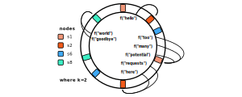

As you know, a hash function maps key values to index values. Typically, these functions are used to determine the location (i.e. index) of a record within a table. They have other applications, such as mapping an image to some hash value. Hash functions are used on a much broader scale for password verification and detection of changes to data. The following image illustrates a few use cases for hash functions.

A hash function represents the binary code representing any hashed meidum. For example, a song can be represented as binary code, which can be input into a hash function. Similarly, an image can be represented as binary code, which can be input into a hash function as well. Likewise, string, integers, etc. can all be represented as binary code, which is the input of a hash function. 

In terms of load balancing, a load balancer receives a request from a client and returns a response from a designated server on our network. If we make multiple servers available to the client, then the load balancer needs to determine which server will provide the client with the fastest possible response time. Typically, this process involves equally distributing the number of requests to the servers within our network. The traditional method for solving this problem involves the use of the modulo operator. For a more detailed explanation about basic hashing, refer to [this video](https://www.youtube.com/watch?v=tHEyzVbl4bg).

Consistent hashing can be found in caching throughout load balancing, such as [Uber's open-sourced RingPop project](https://eng.uber.com/ringpop-open-source-nodejs-library/). Broadly speaking, consistent hashing maps objects to the same cache machine as far as possible. When a machine used for caching is added to the network, the machine takes its share of objects from all the other cache machines and when it is removed, its objects are shared among the remaining machines.

The primary notion behind consistent hashing involves associating each cache with one or more has value intervals, whether the interval boundaries are determined by calculating the hash of each cache identifier. Once the cache is removed, its interval is taken over by a cache with an adjacent interval, while all the remaining caches are unchanged.

More specifically, this process can be defined using the illustration below, and in [these illustrations](https://blog.carlosgaldino.com/consistent-hashing.html). First, we implement a hash ring containing an $M-1$ amount of hashed request ids. Then, we map the available servers in our network on the ring uniformly. Each server is associated with its own hashed request id, which represents a boundary. Once a load balancer receives a request, it maps the hashed request onto the hash ring. Then, this hashed request is mapped to a server immediately clockwise to it.

Since a request is mapped to an immediate server in the clockwise direction, the addition or removal of a server will uniformly affect fewer requests in theory. In other words, we can expect the load to be equally distributed on average, since the hash values are assigned randomly and uniformly.

In practice, there is a greater change of having non-uniform distribution of requests between servers, since we often have a small number of servers on our hash ring. The image below illustrates a scenario where nodes are removed from our ring, creating a non-uniform distribution.

To prevent non-uniform distribution from occurring in our hash ring, we can introduce the idea of virtual nodes. Virtual nodes refer to multiple instances of a server on the hash ring. By using a $k$ number of hash function, each server corresponds to $k$ number of hash values on the ring. This increases the randomness of the load. For a more detailed understanding of consistent hashing and its use cases, refer to [this video](https://www.youtube.com/watch?v=zaRkONvyGr8) and [this article by Tom White](https://tom-e-white.com/2007/11/consistent-hashing.html).

Consistent hashing has a few advantages over standard hashing. In particular, it involves a minimal amount of data transfer between machines, which has been proven to be the most optimal amount. However, there are still a few areas of improvments, such as the client needing to know the number of nodes. The client also must know the location of each node on the circle. To improve upon the method mentioned above, we can implement sharding techniques, which are mentioned [here](http://blog.gaurav.im/2016/11/17/sharding-databases-a-quick-trick/).

The table below illustrates the asymptotic [time complexities](https://en.wikipedia.org/wiki/Consistent_hashing) for $N$ nodes and $K$ keys. The $O(K/N)$ complexity refers to the average cost for redistribution of keys, whereas the $O(logN)$ complexity occurs from a binary search among nodes, in order to find the next node on the ring.

|                     | Classic Hashing | Consistent Hashing |
| ------------------- | --------------- | ------------------ |
| **Adding a node**   | $O(K)$          | $O(K/N + logN)$    |
| **Removing a node** | $O(K)$          | $O(K/N + logN)$    |
| **Adding a key**    | $O(1)$          | $O(logN)$          |
| **Removing a key**  | $O(1)$          | $O(logN)$          |

Consistent Hashing isn't only used in load balancing. It can also be found in database indexing. Generally, there are a few ways to improve the performance of an RDBMS database system. First, we may be interested in very particular performance improvements, so optimizing queries may be the extent of the problem. For broader improvements to the performance of a database, we may want to perform indexing on certain tables.

For database indexing, a B-tree index is used for column comparisons in expressions that use the $>$ and $\le$ operators. A B-tree index can also be used for LIKE comparisons. On the other hand, hash indexes are used for equality comparisons, which involve the $=$ and $<>$ operators. For more information about the use cases of B-tree indexing and hash indexing, refer to the [MySQL docs](https://dev.mysql.com/doc/refman/8.0/en/index-btree-hash.html).

There are a few other improvements we could implement. For example, we may be interested in translating our SQL database over to a NoSQL database, [depending on the structure](https://softwareengineering.stackexchange.com/a/175546) of data being saved. In most cases, it will not be worthwhile to make this change. Lastly, we can implement a data sharding strategy, which is discussed more in the [next post](/blog/shard/).

