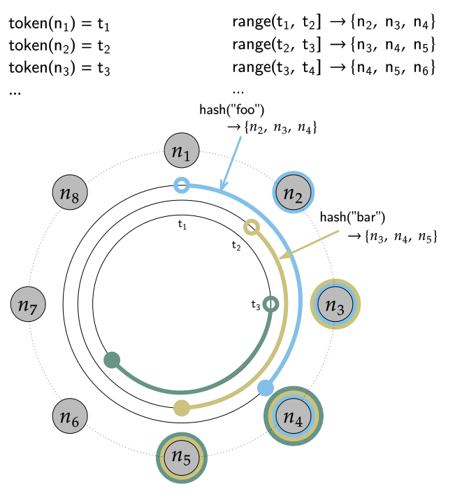

In a [previous post](/blog/nosql/) about NoSQL databases, column-family stores were described at a fairly high-level. In this post, we'll dive into more low-level details, which includes features, behavior, and use cases.

*NoSQL Distilled* is a terrific resource for learning about both high-level and low-level details of NoSQL databases. This post is meant to summarize my experience with these databases, along with particular segments from the book. Again, refer to the book for a deeper dive of relational and NoSQL databases.

## Table of Contents
- [Defining a Column-Family Database](#defining-a-column-family-store)
- [Introduction to the Cassandra Architecture](#introduction-to-the-cassandra-architecture)
- [Features of Column-Family Databases](#features-of-column-family-databases)
- [Using Column-Family Databases](#using-column-family-databases)

## Defining a Column-Family Store
Compared to key-value and document databases, column-family stores impose more limitations on the structure of an aggregate. Specifically, column-family databases organize their columns into column families. Each column must be assigned to a particular column-family. Then, each column can be accessed via a column-family. In particular, accessing a column-family will return each of the columns associated with that column family.

At a high level point of view, a column-family database represents a map consisting of smaller maps, where the first map is a column family and the second map is a row. In the CQL API, column families are referred to as tables. To gain some additional intuition about the data model, let's look at how data is stored in Cassandra:

```cql
-- create keyspace (database)
CREATE KEYSPACE hotel WITH replication =
    {'class': 'SimpleStrategy',
     'replication_factor': 3};

-- create table
CREATE TABLE hotel.employees (
    id text PRIMARY KEY,
    name text,
    roles set,
    salary smallint
)

-- insert row
INSERT INTO hotel.employees
       JSON '{"id": "10F-S53",
              "name": "Susan",
              "roles": {"accountant", "auditor"}}';
```

CQL is a **typed language** used for querying column-family databases in Cassandra. Meaning, Cassandra isn't really schemaless anymore, since data types and primary keys are required. In many ways, CQL feels like SQL, but deliberately excludes certain functionalities that violates their data model. In particular, CQL doesn't support group by operations, join operations, and others.

On the flip side, CQL supports certain functionalities that aren't supported in relational databases, since they violate the relational data model and comply with the column-family data model. For example, CQL supports the use of tuples and sets as data types defined within a schema.

To learn more about the details behind data manipulation with CQL, refer to [the docs](https://cassandra.apache.org/doc/latest/cql/dml.html).

## Introduction to the Cassandra Architecture
Whereas Apache HBase was created based on [Google's BigTable](https://static.googleusercontent.com/media/research.google.com/en//archive/bigtable-osdi06.pdf), Apache Cassandra relies on a number of techniques from [Amazon's Dynamo](https://www.allthingsdistributed.com/files/amazon-dynamo-sosp2007.pdf). For a brief comparison between HBase and BigTable, refer to [this post](https://stackoverflow.com/a/24860743/12777044). Each node in the Dynamo system has three main components:
- Request coordination for each partitioned dataset
- Ring membership and failure detection
- Local storage engine

Cassandra uses most of these features, but uses a storage engined based on LSM instead. To go one level deeper, Cassandra takes the following from Dynamo:
- Dataset partitioning using consistent hashing
- Multi-master replication
- Tunable levels of replication and consistency
- Distributed cluster management
- Distributed failure detection
- Incremental horizontal scaling on commodity hardware

Cassandra partitions (creates shards) data across nodes using consistent hashing. In naive data hashing, keys are allocatd to buckets by hashing the key modulo the number of buckets. Cassandra takes a different approach by first hashing each node to one or more values on a continuous hash ring. These hash values representing each node are referred to as *tokens* in Cassandra. Once tokens are created, Cassandra then is able to map data points to tokens on that same hash ring. Specifically, Cassandra will receive rows, hash the primary keys of each row, and map those hash values to the hash ring. Lastly, Cassandra will map those data points to nodes by rounding their mapped hash values to the nearest token in a clockwise motion on the ring.



The use of consistent hashing for partitioning makes Cassandra a **scalable** and **available** column-family store. There are other features included in the hashing algorithm to improve potential issues with consistency, such as virtual nodes, quorums, and [compaction](https://cassandra.apache.org/doc/latest/operating/compaction/index.html). For more details about the architecture of Cassandra and its more specific hashing features, refer to [the docs](https://cassandra.apache.org/doc/latest/architecture/dynamo.html).

## Features of Column-Family Databases
Unlike some NoSQL databases and most relational databases, Cassandra does not support transactions. Similar to key-item and document stores, wrties are atomic at the row level in Cassandra. Meaning, any transformation of multiple columns of a single row is treated as a single write operation. For more information about atomicity in Cassandra, refer to [the docs](https://docs.datastax.com/en/cassandra-oss/2.1/cassandra/dml/dml_atomicity_c.html).

Returning to the CAP theorem, Cassandra focuses on high availability and scalability. The consistency can be increased with the use of quorums. Each quorum has a replication factor, which can be adjusted to tune the level of availability within our cluster.

Whereas both key-item and document databases are designed using a master-worker architecture, Cassandra uses a peer-to-peer architecture. This choice reaffirms the idea of Cassandra favoring availability and scalability, rather than consistency.

Cassandra effortlessly scales with the addition of nodes. Since Cassandra doesn't promote a master node, it really doesn't need to worry about failures or spend time promoting a new master node.

Lastly, Cassandra supports a fairly robust querying language called CQL. Since Cassandra isn't a relational databases, CQL still has its own limitations compared to SQL. Thus, column families will need to be designed effectively, so they are optimized for reading data.

## Using Column-Family Databases
The table below outlines a few particular use cases for column-family databases. In particular, the column-family databases use Cassandra as a representative of the following use cases. Read more details about the Cassandra use cases in [this post](https://stackoverflow.com/a/30964048/12777044). For more details about individual use cases, refer to the *NoSQL Distilled* text. For a more straightforward comparison between MongoDB and Cassandra, read [this article](https://phoenixnap.com/kb/cassandra-vs-mongodb).

| Use-Case                   | Good or Bad? |
| -------------------------- | ------------ |
| Event logging              | Good         |
| Blogging sites             | Good         |
| Content management systems | Good         |
| Real time analytics        | Good         |
| Page counters              | Good         |
| Systems requiring ACID     | Bad          |
| Early prototypes           | Bad          |

