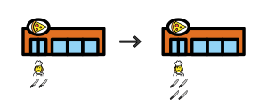
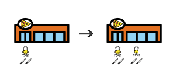
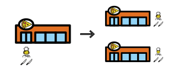
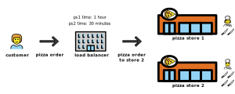

In computer science, systems design refers to the process of defining and developing a system that satisfies certain requirements made by the user. Obviously, this involves a detailed understanding of the components within a system and how they interact with each other. In particular, this process usually involves knowing the input requirements, output requirements, storage requirements, processing requirements, etc. Specifically, the following concepts can help improve a particular system being managed:
- [Vertical scaling](#running-a-single-pizza-shop)
- [Scheduling batch jobs](#preparing-pizzas-in-advance)
- [Assigning backup servers](#recovering-from-failures-quickly)
- [Horizontal scaling](#hiring-additional-chefs)
- [Developing a distributed system](#adding-additional-pizza-shops)
- [Load balancing](#efficiently-managing-pizza-orders)
- [Logging and calculating metrics](#monitoring-the-performance-of-our-shops)

Interestingly, these same concepts can be applied to many problems outside of computer science, such as running a pizza chain efficiently. This post was motivated by [this great video](https://www.youtube.com/watch?v=SqcXvc3ZmRU&list=PLMCXHnjXnTnvo6alSjVkgxV-VH6EPyvoX&index=2), so please refer to it for more details.

## Running a Single Pizza Shop
In this example, we'll consider a single pizza parlor as a cluster, whereas a single chef is a single computer. Then, we can think of an order as a request to our server. In the technical sense, horizontal scaling would imply hiring additional chefs to our pizza parlor. On the other hand, vertical scaling would imply purchasing additional technology for an individual chef to help them work harder.

In a distributed system, our goal is to increase the throughput of incoming requests by optimizing resources and running processes. One way of achieving this in our pizza shop analogy is through vertical scaling, or expanding the limits of a chef so they can handle more work. This improvement to the system is analogous to the change to the pizza shop illustrated below.

## Preparing Pizzas in Advance
In most cases, the peak hours of a pizza shop is during the day. In order to ease the workload on our chef during these peak hours, he or she can prepare pizzas during the night. The chef would prefer preparing pizzas after hours to avoid preparing pizzas during the day, when he or she has many orders to handle.

In computer science, this could look like setting up batch jobs to process large amounts of data during the nights. Usually, these could be in the form of cron jobs, and they can run for a few hours during 3AM-4AM. Specifically, we wouldn't want to run these batch jobs during the day, since this could harm the performance of users querying our database.

## Recovering from Failures Quickly
In any system, we want to avoid having a single point of failure. Indicating, our system should be resilient. When managing a pizza store with a single chef, there should be one or more chefs on call, in case the chef calls in sick. Otherwise, the business would be shut down for the day the chef calls in sick, causing this to be a single point of failure. In our system, we would want to create backup servers in this case. Then, our backup server would fill in for our worker server.

## Hiring Additional Chefs
Clearly, only employing a single chef at our pizza shop becomes a greater problem if we need to handle a much larger number of pizza orders. Hiring additional chefs can also prevent a single point of failure, since our shop still can function if one chef calls off. In other words, we can hire more pizza chefs to scale up our pizza shop. 

In a distributed system, this concept translates to purchasing additional servers to handle more requests. This improvement to the system is analogous to the change to the pizza shop illustrated below.

Vertical scaling and horizontal scaling typically are used together in a system. When systems observe a problem requiring either horizontal scaling and vertical scaling, we can make the appropriate changes based on the properties of the problem. In particular, we can use the more general use cases provided below to determine which type of scaling should be applied.

| Property                   |  Horizontal                   | Vertical                |
| -------------------------- | ----------------------------- | ----------------------- |
| **Load Balancing**         | Yes                           | N/A                     |
| **Resilient**              | Yes                           | Single point of failure |
| **Speed of Communication** | Slower (RPC)                  | Faster (IPC)            |
| **Consistency**            | Inconsistent                  | Consistent              |
| **Scalability**            | Scales well as users increase | Hardware limits         |

## Adding Additional Pizza Shops
For creating a truly scalable pizza chain, there should be more than one pizza shop. To illustrate this point, suppose our shop experiences a power outage for an entire day. In this case, our pizza shop couldn't accept any orders and would need to close down for the day. Expanding our pizza shop to other locations could help solve this problem.

By building additional shops, we still can handle orders in case a single shop experiences a power outage. Also, pizzas can be delivered at a faster rate if orders are handled at a shop closter to the customer. These pizza shops need to be able to communicate with each other, but should be able to handle orders on their own in case one shop isn't available.

Adding additional shops is analogous to creating new servers or even clusters in a distributed system. Similarly, these servers need to be able to communicate with each other. Creating new servers or clusters leads to a more fault-tolerant and responsive distributed system. For example, AWS will include multiple servers from different datacenters within their clusters, which leads to faster response times.

## Efficiently Managing Pizza Orders
Ideally, customers would submit an order for delivery to an entry point for our delivery services, which could be a site, app, or specific number. Then, a manager would determine a store that efficiently prepares the pizza and delivers it in the fastest possible time frame. The image below illustrates a load balancer as a central office for our delivery services. 

In a distributed system, the component responsible for managing the load and forwarding of a request is known as a *load balancer*. Specifically, a load balancer is responsible for dispatching requests based on statistics saved by it or some other external agent. In other words, a load balancer will receive a request and determine the optimal node that should process the request.

## Monitoring the Performance of our Shops
As we build even more shops and hire additional chefs to handle the demand for our delicious pizza, monitoring the performance, decisions, and actions of our employees and shops becomes difficult. As a result, logging the decisions and calculating metrics on these components becomes critical. Automating behavior based on these logs becomes even more critical if we want to build a truly scalable pizza shop.

Similarly, we should log information, warning, and errors within our system to measure. In other words, creating a system for logging is important to ensure nodes and clusters are behaving as expected.

