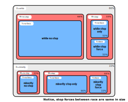

Over the last decade, I've grown up hearing and reading about police-related killings of unarmed black men, including Eric Garner, Michael Brown, Ronell Foster, George Floyd, and countless others. Naturally, there have been growing concerns about officers systematically discriminating against minorities, which has become one of the most important issues in modern-day policing. Unfortunately, this problem [doesn't have such a straightforward causal answer](https://en.wikipedia.org/wiki/Police_use_of_deadly_force_in_the_United_States) for various reasons, if you're the ordinary layperson searching for clarity on the matter.

First, causal inference about race and policing is difficult to study due to a lack of unbiased data. [Some of the most cited research papers](https://scholar.harvard.edu/files/fryer/files/empirical_analysis_tables_figures.pdf) about this topic use data provided by police forces, which suffers from confounding. For example, bias may be introduced if the data provided by polices forces are already engaging in racially-biased practices.

Throughout the last few decades, Congress has recognized this problem involving a lack of data about race and policing. In 1994, Congress instructed the Attorney General to publish annual statistics on police use of excessive force. However, this was not carried out effectively. Since then, two national systems have been built that collect data including homicides committed by law enforcement officers: the [CDC's NVSS](https://www.cdc.gov/nchs/nvss/index.htm) and the [FBI's UCR](https://www.fbi.gov/services/cjis/ucr/use-of-force).

The NVSS aggregates data from locally filed death certificates. However, the certificates don't document whether a killing is legally justified or not. Also, the certificates don't document whether a law enforcement officer is involved in a killing or not. On the other hand, the UCR system maintains data about police use of force. However, this relies on law enforcement agencies to submit a report voluntarily.

Clearly, governmental entities haven't made much progress in collecting unbiased and comprehensive data for police use of force, which has led to more recent efforts of data collection made by crowd-sourced projects and research institutions.

## The Search for Answers

[Fryer](https://scholar.harvard.edu/files/fryer/files/empirical_analysis_tables_figures.pdf) collected data in several databases, which he hoped would shed some light on police patterns. Two were public-use data sets: the [New York City Stop-and-Frisk database](https://www.nyclu.org/en/stop-and-frisk-data) and the [Police-Public Contact Survey](https://bjs.ojp.gov/data-collection/police-public-contact-survey-ppcs). The first data set includes data about the NYPD's police stops and questioning of pedestrians, if officers decide to stop and frisk pedestrians for weapons or contraband. The surveys include data about civilians describing interactions with the police, including the use of force. For more information about Fryer's data collection methodologies, please refer to [this text](https://mixtape.scunning.com/dag.html#collider-bias-and-police-use-of-force).

Fryer's findings have been quite controversial and politicized after his paper was published in 2016. In 2020, [a Princeton study](https://scholar.princeton.edu/sites/default/files/jmummolo/files/klm.pdf) disputed the findings, claiming data about white pedestrians might not be the same as non-white pedestrians, if police had a higher threshold for stopping white pedestrians. In the same year, economists from the University of Chicago published [a response to Fryer's study](https://www.journals.uchicago.edu/doi/abs/10.1086/710976), stating Fryer's paper *"doesn't establish credible evidence on the presence or absence of discrimination against Americans in police shootings"* due to selection bias. Eventually, Fryer published [a response in the WSJ](https://www.wsj.com/articles/what-the-data-say-about-police-11592845959), reaffirming his findings as unbiased and responding to those criticisms he had received. He pointed to other recent studies from the [Injury Prevention Journal](https://injuryprevention.bmj.com/content/injuryprev/23/1/27.full.pdf) and [Center for Policing Equity](https://policingequity.org/images/pdfs-doc/CPE_SoJ_Race-Arrests-UoF_2016-07-08-1130.pdf), which have found similar results in comparison to Fryer's findings. We should note that they use the already criticized FBI data, however. Regardless, he acknowledges the existence of unchecked racial disparities today and in previous decades, and he believes his findings are enough to *"justify sweeping reform."*

## A Glimpse into Fryer's Findings

A few facts are especially important to highlight about Fryer's study. First, Fryer finds that blacks and Hispanics are more than $50 \%$ more likely to have an interaction with police involving any use of force. In his full model using the stop-and-frisk data, he finds that blacks are $21 \%$ more likely than whites to be involved in an interaction with police where a weapon is drawn. Note, this difference is statistically significant in the study.

Once Fryer moves to the administrative data, he surprisingly finds that there are no racial differences in officer-involved shootings for police interactions. In fact, he finds blacks are $27 \%$ less likely to be shot at by police than non-black and non-hispanic suspects, after controlling for the following variables:
- Suspect demographics
- Officer demographics
- Encounter characteristics
- Suspect weapon
- Year fixed effects

Note, this coefficient is measured with considerable error and is not statistically significant. In other words, Fryer is unable to use this data to find evidence for racial discrimination in officer-involved shootings.

## Potential Issues with Collider Conditioning

As I mentioned already, Fryer's study generated skepticism amongst some researchers, including [Dean Knox](https://polmeth.mit.edu/sites/default/files/documents/Jonathan_Mummolo.pdf) and [Scott Cunningham](https://mixtape.scunning.com/dag.html#collider-bias-and-police-use-of-force). They suggest the administrative data sources potentially are endogenous because of conditioning on a collider. If this is true, then the administrative data itself may include a racial bias.

Fryer's study finds that minorities are more likely to be stopped in both the stop-and-frisk data and the Police-Public Contact Survey data. He introduces many controls for $X$ in the above DAG. Meaning, he's captured and controlled for hundreds of variables relating to the use of force $Y$, which include the nature of a police interaction, time of day, etc. By controlling for $X$, Fryer is able to close any backdoor path stemming from $X$.

Most importantly, [Knox](https://polmeth.mit.edu/sites/default/files/documents/Jonathan_Mummolo.pdf) and [Cunningham](https://mixtape.scunning.com/dag.html#collider-bias-and-police-use-of-force) point out the presence of collider bias by focusing on an officer's stop $M$. Since the administrative data only includes data about police-initiated stops, each observation is *conditional* on a stop. Fryer acknowledges this:

> Unless otherwise noted, all results are conditional on an interaction. Understanding potential selection into police data sets due to bias in who police interacts with is a difficult endeavor.

Conditioning on the stop variable $M$ opens up a *mediated path* $D \to M \gets U \to Y$. If there is discrimination happening in $D \to M$, spurious correlations could be created and any causal relationship between police and racial differences in shootings may be inaccurate. In other words, if there isn't racial discrimination in who the officier stops, then the correlations observed in the administrative data aren't spurious and instead induced by causal effect. Meaning, it would be fine to use this administrative data if this assumption is true. However, it would be a mistake to assume there isn't discrimination happening here, especially in a study about discrimination. As a result, we probably shouldn't make this assumption, which is in fact made in Fryer's study.

To help illustrate this point, maybe officers have a higher threshold for feeling the behavior of a white civilian is suspicious, compared to the their threshold for feeling the behavior of a minority is suspicious. Consequently, the pool of stopped white civilians would become oversaturated with more truly suspicious civilians, whereas the pool of stopped minority civilians would become undersaturated with less truly suspicious civilians. Therefore, Fryer's data first must include this missing information in order to make any accurate conclusions about the causal relationship between police and racial differences in shootings.

In [a presentation](https://www.youtube.com/watch?v=Kdj81skxlWM&t=286s) at the National Institute of Statistical Sciences, Knox illustrates his point with a convincing visual provided below. He breaks down an example where a higher percentage of minority civilians are shot by officers compared to white civilians, relative to the total number of civilians in each racial community. However, by shifting our focus to stops only, a higher percentage of white civilians appear to be shot compared to minority civilians. Intuitively, this could look like more officers stopping minorities for something as mild as jaywalking, whereas white civilians are stopped only when there is more truly suspicious behavior, such as pickpocketing or robbery.

Specifically, $\frac{1}{8}$ of all white civilians are shot by officers, compared to $\frac{1}{4}$ of all minority civilians are shot by officers. But, by shifting our focus to stops, $\frac{1}{2}$ of stopped white civilians are shot by officers, compared to $\frac{1}{3}$ of stopped minority civilians. According to Knox, our conclusions could be reversed entirely depending on our analysis. In particular, Fryer's study naively concludes that there's anti-white bias because:

$$
\frac{\text{w.s.f.}}{\text{w.s.o. } + \text{ w.s.f.}} > \frac{\text{m.s.f.}}{\text{m.s.o. } + \text{ m.s.f.}}
$$

In order to make a conclusion about racial discrimination and policing for the entire race, Knox believes a more fair comparison would require expanding this analysis to also include non-stops for each race as well. Otherwise, Fryer's study (and others) can lead to dramatic underestimates of bias in force.

After correcting for this bias, Knox finds evidence that there is anti-minority bias by a large margin [his own analysis](https://youtu.be/Kdj81skxlWM?t=1243). Specifically, Knox develops a method for correcting this bias, which places bounds on the severity of the selection problems. After applying this correction using this bounding approach, they find that even lower-bound estimates of the incidence of police violence against civilians is as much as $5$ times higher than a traditional approach that ignores the sample selection problem altogether.

For more information about Knox's study, refer to [his paper](ttps://polmeth.mit.edu/sites/default/files/documents/Jonathan_Mummolo.pdf) for a more detailed analysis with his findings, or watch [his presentation](https://www.youtube.com/watch?v=Kdj81skxlWM) about his findings at a NISS conference. For additional illustrations about collider bias in Fryer's study, refer to [this paper](https://arxiv.org/pdf/2007.08406.pdf) as well.

For additional high-level details and illustrations about the presence of collider bias in studies about policing and racial discrimination, refer to [this FiveThirtyEight article](https://fivethirtyeight.com/features/why-statistics-dont-capture-the-full-extent-of-the-systemic-bias-in-policing/).