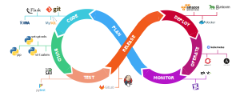
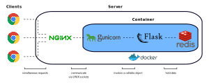

Most data science projects undergo various stages, which require communication with the business, determining use cases and opportunities with high ROIs, collecting and exploring raw data, feature engineering, and iterating through potential models.

Furthermore, these stages don't usually occur in perfectly successive steps. Rather, they generally follow an iterative cycle, where we may return to a stage after making changes to another stage. Evidently, this system consists of many moving parts, which calls for a rapid prototyping environment.

## Table of Contents
- [Motivating a Data Science Pipeline](#motivating-a-data-science-pipeline)
- [Outlining a Prototyping Pipeline](#outlining-a-prototyping-pipeline)
- [Illustrating our Project Layout](#illustrating-our-project-layout)
- [Defining a Flask Application](#defining-a-flask-application)
- [Defining NGINX Configurations](#defining-nginx-configurations)
- [Defining Gunicorn Configurations](#defining-gunicorn-configurations)
- [Defining the Dockerfile](#defining-the-dockerfile)

## Motivating a Data Science Pipeline
The DevOps lifecycle delineates the journey of project development. At a high level, it determines a philosophy that enforces agility and collaboration between software development and IT operations. There are 8 phases included in the DevOps lifecycle, but this post won't be going into these specifics. For details about individual phases within the DevOps lifecycle, refer to [these articles](https://realpython.com/tutorials/devops/), which introduce DevOps solutions in Python.



To motivate the use of a prototyping pipeline, we'll focus on the *plan* and *code* phase for most of this post. As stated previously, there are many moving parts in a data science pipeline. Generally, any prototyping pipeline will include the following steps:
- Understanding a business problem
- Collecting or locating any raw data
- Performing exploratory data analysis
- Performing feature engineering
- Building and evaluating models
- Deploying ultimate model

Notice, the majority of these steps happen during the code phase, and these are only a small percentage of the complete set of operations that occur throughout the entire lifecycle. Automating these steps in a standardized environment provides benefits, such as continuous deployment, continuous testing, and process efficiency. In other words, building a rapid prototyping pipeline can help automate these steps, which facilitates project development.

## Outlining a Prototyping Pipeline
When assembling my own prototyping pipelines, I personally prefer to build web applications using [Flask](https://flask.palletsprojects.com/en/1.1.x/), rather than Django. In particular, I use [Dash](https://dash.plotly.com/integrating-dash) for quickly building data visualizations and interfaces, where Dash uses the Flask micro-framework under the hood. As a result, it is fairly straightforward to embed a Dash app at a specific route of an existing Flask app.

Furthermore, a WSGI server can be used as an application server. It handles requests meant for our actual applications, which are passed on from the web server. Personally, I'll use Gunicorn for this setup, but there are many other [WSGI servers](https://flask.palletsprojects.com/en/1.1.x/deploying/wsgi-standalone/) that contain WSGI applications and serve HTTP.

Similarly, there are many HTTP web servers available, but Nginx is [highly suggested](https://docs.gunicorn.org/en/stable/deploy.html) when working with Gunicorn. Again, Nginx is our web server, which accepts the client requests and handles any HTTP connections. These HTTP requests are passed on to the Gunicorn WSGI servers. When combining these components together, our pipeline begins to take the following shape:



Although Nginx sits inside the same server as the Flask web application in this example, it can be served on its own server. Also, the web server can run in a docker container that is located within or outside of the container running our web application. In a productionized environment, we may think about running the Nginx web server to help balance the load.

In the Gunicorn documentation, the recommended number of workers is 2-4 workers per core. For horizontal scaling, Kubernetes is used to scale the number of deployments, each running a Gunicorn WSGI server with multiple workers. For more information about the implementation of Kubernetes, Gunicorn, and other components of our pipeline, refer to [this post](https://stackoverflow.com/a/51873337/12777044).

## Illustrating our Project Layout
All files related to Docker and Gunicorn are located in the `deploy` directory in our project layout. The files related to our Flask web application are located in the `src` directory in our project layout. Ultimately, our project layout looks like the following:

```text
myapp/
├── deploy/
│   ├── docker-entrypoint.sh
│   ├── Dockerfile
│   ├── nginx.conf
│   ├── supervisord.conf
│   └── conf.ini
└── src/
    ├── __init__.py
    └── app.py
```

The `app.py` contains the code for our web application. Whereas, the `conf.py` file contains configuration details for a Gunicorn WSGI server. The remaining files in the `deploy` directory mostly relate to Docker configurations.

## Defining a Flask Application
In this post, we'll build a simple Flask web application running on Docker Compose. Specifically, the application outputs a request counter maintained in Redis. The following is sample code from our application:

```python
# app.py
import time
import redis
from flask import Flask

app = Flask(__name__)
cache = redis.Redis(host='redis', port=6379)

def get_hit_count():
  retries = 5
  while True:
    try:
      return cache.incr('hits')
    except redis.exceptions.ConnectionError as exc:
      if retries == 0:
        raise exc
      retries -= 1
      time.sleep(0.5)

@app.route('/')
def hello():
  count = get_hit_count()
  return 'I've been seen {} times.\n'.format(count)
```

In this exmaple, `redis` is the hostname of the redis container located on the same network as this application. We use the default port for Redis, which is `6379`. This [article](https://realpython.com/flask-by-example-implementing-a-redis-task-queue/) illustrates a more detailed example using a redis task queue. For a deeper explanation about our simple Python web application, refer to the [getting-started docs](https://docs.docker.com/compose/gettingstarted/), which uses this example with Docker compose in greater detail.

## Defining NGINX Configurations
In this post, our Nginx web server and Gunicorn WSGI server handles client requests and eventually runs our flask application as a result. Therefore, we need to configure our Nginx web server. These configurations are suggested in greater detail in the [Gunicorn docs](https://docs.gunicorn.org/en/stable/deploy.html), but we'll simplify the file to only include barebones specifications in the `nginx.conf` file:

```apacheconf
worker_processes 1;

pid /var/run/nginx.pid;
error_log /var/log/nginx/error.log warn;

events {
  worker_connections 1024;
}

http {
  include mime.types;
  default_type application/octet-stream;
  sendfile on;

  upstream app_server {
    server unix:/tmp/guni.sock fail_timeout=0;
  }

  server {
    listen 8080;
    server_name localhost;
    client_max_body_size 4G;
    keepalive_timeout 5;

    root /home/dkharazi/dev/myapp/public;

    location / {
      try_files $uri @app;
    }
    location @app {
      proxy_set_header X-Forwarded-For
        $proxy_add_x_forwarded_for;
      proxy_set_header X-Forwarded-Proto
        $scheme;
      proxy_pass
        http://localhost:8050;
    }
  }
}
```

Nginx configuration files are located in the `/etc/nginx` directory, where the primary configuration file refers to `/etc/nginx/nginx.conf`. In Nginx, configuration options are called *directives*, which are organized into groups known as contexts.

By default, the process ID of the nginx master process is written to the `nginx.pid` file in the `/var/run` directory. Here, we are specifying the process ID to be written to that directory, but can change it to some different directory.  In a similar fashion, the error logs are written to the default directory.

The [events directive](http://nginx.org/en/docs/ngx_core_module.html#events) specifies the context of the main configuration file. Here, we'll identify any directives related to the processing of connections. To keep things simple, we'll only specify the maximum number of simultaneous connections that can be opened by a worker.

The [http directive](http://nginx.org/en/docs/http/ngx_http_core_module.html#http) specifies the context of the main configuration related to HTTP server directives. Here, we'll define some basic configurations, such as the default MIME type of a response, a flag for blocking I/O to disk, and WSGI server specifications. Additionally,  the server directive is specified, which sets configurations for our virtual server and points Nginx to the location of our web application. These configurations redefine any appending fields to the request header, which are passed to the proxied server. Specifically, they use embedded variables, such as `proxy_add_x_forwarded_for`, which refers to the remote address of the client.

In our situation, we want to assign our Nginx to a port below 1024, which are privaleged ports. Also, we're informing Nginx to route all requests to the Gunicorn socket and Python application when specifying the location of `@app`.

For additional detils about the more basic configurations, refer to [this guide](http://nginx.org/en/docs/beginners_guide.html). Also, refer to [the docs](http://nginx.org/en/docs/ngx_core_module.html) for more details about the behavior of any particular syntax.

## Defining Gunicorn Configurations
Again, our Nginx web server and Gunicorn WSGI server handles client requests and eventually runs our flask application as a result. Therefore, we need to configure our Gunicorn WSGI server. These configurations are suggested in greater detail in the [Gunicorn docs](https://docs.gunicorn.org/en/stable/deploy.html), but we'll simplify the file to only include barebones specifications in the `conf.ini` file:

```ini
[app:server]
bind = localhost:8050
workers = 4
name = 'myapp'
daemon = True
```

The `bind` setting refers to the socket to which the Gunicorn WSGI server binds itself. The `workers` setting refers to the number of worker processes for handling requests. The recommended value for this setting is $2 \times \text{num cores}$. This setting should be adjusted in order to find the best for our work load, since it depends on the hardware of our server. The `daemon` setting specifies that the app will run in the background on our server. For details about more specific settings in the configuration file, refer to the [Gunicorn docs](https://docs.gunicorn.org/en/latest/settings.html).

## Defining the Dockerfile
Docker recommends running one process per container for [these reasons](https://devops.stackexchange.com/a/451). If there is a need to run our WSGI server and Nginx web server in the same container, we can use [supervisord](https://stackoverflow.com/a/43510962/12777044) to create and manage processes based on data in its configuration file, which creates subprocesses. Docker outlines their [best practices](https://docs.docker.com/config/containers/multi-service_container/) for running multiple services within a single container.

In this example, our Dockerfile builds a Python 3.7 image. We'll also define a compose file, which will reference two individual services: `web` and `redis`. Specifically, these will be outlined in the `docker-compose.yml` file. 

```docker
FROM python:3.7-alpine
WORKDIR /myapp
ENV FLASK_APP app.py
ENV FLASK_RUN_HOST 0.0.0.0
RUN apk add --no-cache gcc musl-dev linux-headers
COPY requirements.txt requirements.txt
RUN pip install -r requirements.txt
COPY . .
CMD ["flask", "run"]
```

To translate some of these commands, the Dockerfile starts off with building an image using the Python 3.7 image. Then, it assigns the working directory to `/myapp`. Next, it sets the environment variables used by the [flask command](https://flask.palletsprojects.com/en/1.1.x/cli/). Gcc is installed so Python packages, such as SQLAlchemy, can compile speedups. The `requirements.txt` file is copied, which installs the Python dependencies, and it is run after being copied. Then, all of the files from the current directory `.` are copied to the workdir `.` in the image. Lastly, the `flask run` command is run in the container.

As stated previously, we want to define two different services, so they can run in their own individual containers. Creating a `docker-compose.yml` file will make this possible. In particular, we can create a file called `docker-compose.yml`, which will contain the following contents:

```yml
version: '3'
services:
  web:
    build: .
    ports:
      - "5000:5000"
  redis:
    image: "redis:alpine"
```

The `web` service uses the Python 3.7 image built from the Dockerfile. On the other hand, the `redis` service uses the Redis image pulled from the Docker Hub registry. Port 5000 of the container is bound to port 5000 of our machine, which is the default port for the Flask web service. We can run these containers by running the following commands:

```bash
$ docker-compose up
```

After the command finishes executing, our container should be running. Now, we can enter `http://localhost:5000` in our browser to see the application running. For additional information about specific configurations available to the Compose file, refer to the [Docker docs](https://docs.docker.com/compose/compose-file/).


