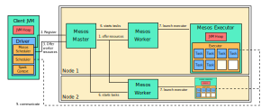

This post walks through an example of running a cluster using a Mesos cluster manager on Mac OS. In the coming posts, we'll explore other examples, including clusters running a [standalone](/blog/spark-standalone/) cluster manager and a cluster manager in [YARN](/blog/spark-yarn/).

## Table of Contents
- [Describing the Mesos Architecutre](#describing-the-mesos-architecture)
- [Comparing Mesos and Standalone Architectures](#comparing-mesos-and-standalone-architectures)
- [Setting up Mesos](#setting-up-mesos)
- [Setting up a SparkSession](#setting-up-a-sparksession)
- [Launching Mesos Daemons](#launching-mesos-daemons)
- [Launching Spark Daemons](#launching-spark-daemons)
- [Accessing Web UI for Daemons](#accessing-web-ui-for-daemons)
- [Launching Applications in Client Mode](#launching-applications-in-client-mode)

## Describing the Mesos Architecture
The Mesos architecture is arguably more similar to the standalone architecture, compared to the YARN architecture. This is because the essential components of the Mesos architecture include a master and workers only. In the Mesos architecture, a master schedules worker resources for applications that need to use them. Then, workers launch executors for applications, which execute tasks.

Mesos can run Docker containers. As a result, Mesos essentially can run any application that can be set up in a Docker container, which includes Spark applications.

Generally, Mesos is more powerful than a cluster with a Spark standalone cluster manager. Mesos can be used for applications other than Spark, as well. Specifically, it can be used for Java, Scala, Python, and other applications. It can also do more than schedule CPU and RAM resources. In particular, it is capable of scheduling disk space, network ports, etc.

Spark applications running on Mesos consist of two components. These two components include a scheduler and executor. The scheduler accepts or rejects CPU and RAM resources offered by the Mesos master. Then, this master automatically starts Mesos workers, which automatically start executors. Lastly, Mesos executors run tasks as requested by the scheduler.

## Comparing Mesos and Standalone Architectures
Resource scheduling is the most distinct difference between the Mesos and standalone architectures. Specifically, a standalone cluster manager *automatically* assigns resources to applications. A Mesos cluster manager *optionally* offers resources to applications. In this case, an application can accept and refuse the resources.

## Setting up Mesos
1. Install Mesos
```bash
$ brew install mesos
```

2. Install the ZooKeeper dependency
```bash
$ brew install zookeeper
```

3. Optionally, assign IP addresses for masters in `/etc/mesos/zk`:
```text
zk://192.0.2.1:2181,192.0.2.2:2181/mesos
```

## Setting up a SparkSession
1. Download [Spark 2.4.6](https://apache.claz.org/spark/spark-2.4.6/spark-2.4.6-bin-hadoop2.7.tgz)
2. Add the path for Spark in `.bash_profile`:

```text
export SPARK_HOME=./spark-2.4.6-bin-hadoop2.7
```

3. Create the file `./conf/spark-defaults.conf`:

```text
spark.master=yarn
spark.driver.am.memory=512m
spark.yarn.am.memory=512m
spark.executor.memory=512m
spark.eventLog.enabled=true
spark.eventLog.dir=./tmp/spark-events/
spark.history.fs.logDirectory=./tmp/spark-events/
spark.driver.memory=5g
```

4. Create a Spark application:

```python
# test.py
>>> from pyspark import SparkContext
>>> file = "~/data.txt"  # path of data
>>> masterurl = 'spark://localhost:7077'
>>> sc = SparkContext(masterurl, 'myapp')
>>> data = sc.textFile(file).cache()
>>> num_a = data.filter(lambda s: 'a' in s).count()
>>> print(num_a)
>>> sc.stop()
```

## Launching Mesos Daemons
1. Start the master:
```bash
$ sudo service mesos-master start
```

2. Start a worker:
```bash
$ sudo service mesos-slave start
```

3. Stop the master:
```bash
$ sudo service mesos-master stop
```

4. Stop a worker:
```bash
$ sudo service mesos-slave stop
```

## Launching Spark Daemons
1. Start a master daemon in standalone mode
```bash
$ ./sbin/start-master.sh
```

2. Start a worker daemon
```bash
$ ./sbin/start-slave.sh spark://localhost:7077
```

3. Start a history daemon
```bash
$ ./sbin/start-history-server.sh
```

4. Start a Spark application
```bash
$ ./bin/spark-submit \
    --master mesos://localhost:5050 \
    test.py
```

5. Stop the daemons
```bash
$ ./sbin/stop-master.sh
$ ./sbin/stop-slave.sh
$ ./sbin/stop-history-server.sh
```

## Accessing Web UI for Daemons
Mesos provides a web UI for each initialized daemon. By default, Spark creates a web UI for the master on port `5050`. The workers can take on different ports and can be accessed via the master web UI. The history server can be accessed on port `18080` by default. The table below summarizes the default locations for each web UI.

| Daemon                | Port    |
| --------------------- | ------- |
| Mesos Master          | `5050`  |
| Spark History         | `18080` |

## Launching Applications in Client Mode
1. Mesos workers offer their resources to the master
2. The Mesos scheduler registers with the Mesos master
	- The Mesos master is located in the cluster
	- The Mesos scheduler is Spark's Mesos-specific scheduler
	- The Mesos scheduler runs in the driver
3. The Mesos master offers available resources to the Mesos scheduler
	- This happens continuously
	- The offer is sent out every second while master is alive
4. The Mesos scheduler accepts some of the resources
5. The Mesos scheduler sends metadata about the resources to the Mesos master
	- This metadata includes information about these resources and tasks that run these resources
6. The Mesos master asks the workers to start the tasks with its specified resources
7. The Mesos workers launch Mesos executors
8. The Mesos executors launch Spark executors consisting of Tasks
9. The Spark executors communicate with the Spark driver


