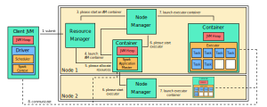
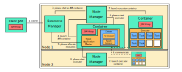

This post walks through an example of running a cluster using a YARN cluster manager on Mac OS. In the coming posts, we'll explore other examples, including clusters running a [standalone](/blog/spark-standalone/) cluster manager and [Mesos](/blog/spark-mesos/) cluster manager.

## Table of Contents
- [Describing the YARN Architecutre](#describing-the-yarn-architecture)
- [Comparing YARN and Standalone Architecture](#comparing-yarn-and-standalone-architectures)
- [Setting up Hadoop](#setting-up-hadoop)
- [Setting up a SparkSession](#setting-up-a-sparksession)
- [Launching YARN Daemons](#launching-yarn-daemons)
- [Launching Spark Daemons](#launching-spark-daemons)
- [Accessing Web UI for Daemons](#accessing-web-ui-for-daemons)
- [Launching Applications in Client Mode](#launching-applications-in-client-mode)
- [Launching Applications in Cluster Mode](#launching-applications-in-cluster-mode)

## Describing the YARN Architecture
There are many redundancies found throughout the standard YARN architecture compared to the standalone architecture in Spark. There are a few additional components in YARN that replaces some of the daemons in the standalone architecture:
- Resource Manager
- Node Manager
- Containers
- Application Master

Essentially, the resource manager is the same as the master process in Spark's standalone mode. The node manager is essentially the same as the worker process. There is a single resource manager per cluster and a single node manager per node in the cluster. 

Rather than representing executors and processes as JVM instances, YARN represents them as containers. However, each containers is still run as a JVM with a requested heap size. These containers contain an application master, which is responsible for requesting application resources from the resource manager.

When an application is run using YARN, the driver process acts as the YARN application master in Spark. Then, node managers monitor CPU and RAM resources used by containers. As a result, they report these resources to the resource manager.

## Comparing YARN and Standalone Architectures
Although a the standalone Spark cluster manager and the YARN cluster manager has a lot of similarities, some of the responsibilities change and JVM instances behave differently. Primarily, resource scheduling is performed by the master JVM in standalone mode, whereas it is performed by the resource manager in YARN.

Executors are asked to start by the master JVM in standalone mode, whereas they are asked to start by the application master in YARN. Job scheduling still is performed by the Spark scheduler in both modes. When Spark is running on YARN, the Spark driver process acts as the YARN application master. Additionally, YARN refers to its processes as containers, rather than JVM instances in standalone mode.

## Setting up Hadoop
1. Install Hadoop:

```bash
$ brew install hadoop
```

2. Download Java version supported by Hadoop 3.0:

```bash
$ brew cask install java8
```

3. Configure the path of Java ran by Hadoop:

```text
# /usr/local/Cellar/hadoop/3.2.1_1/libexec/etc/hadoop-env.sh
export JAVA_HOME=/Library/Java/JavaVirtualMachines/jdk1.8.0_231.jdk/Contents/Home
```

4. Configure the HDFS address:

```xml
<!--/usr/local/Cellar/hadoop/3.2.1_1/libexec/etc/core-site.xml-->
<configuration>
  <property>
    <name>
      hadoop.tmp.dir
    </name>
    <value>
      /usr/local/Cellar/hadoop/hdfs/tmp
    </value>
    <description>
      A base for other temporary directories
    </description>             
  </property>
  <property>
    <name>
      fs.default.name
    </name>
    <value>
      hdfs://localhost:8020
    </value>
  </property>
</configuration>
```

5. Configure the MapReduce JobTracker address:

```xml
<!--/usr/local/Cellar/hadoop/3.2.1_1/libexec/etc/mapred-site.xml-->
<configuration>
  <property>
    <name>
      mapred.job.tracker
    </name>
    <value>
      localhost:8021
    </value>
  </property>
</configuration>
```

6. Configure the HDFS properties:

```xml
<!--/usr/local/Cellar/hadoop/3.2.1_1/libexec/etc/hdfs-site.xml-->
<configuration>
  <property>
    <name>
      dfs.replication
    </name>
    <value>
      1
    </value>
  </property>
</configuration>
```

7. Configure SHH Keys:

```bash
$ ssh-keygen -t rsa -P '' -f ~/.ssh/id_rsa
$ cat ~/.ssh/id_rsa.pub >> ~/.ssh/authorized_keys
$ chmod 0600 ~/.ssh/authorized_keys
```

## Setting up a SparkSession
1. Download [Spark 2.4.6](https://apache.claz.org/spark/spark-2.4.6/spark-2.4.6-bin-hadoop2.7.tgz)
2. Add the path for Spark in `.bash_profile`:

```text
export SPARK_HOME=./spark-2.4.6-bin-hadoop2.7
```

3. Create the file `./conf/spark-defaults.conf`:

```text
spark.master=yarn
spark.driver.am.memory=512m
spark.yarn.am.memory=512m
spark.executor.memory=512m
spark.eventLog.enabled=true
spark.eventLog.dir=./tmp/spark-events/
spark.history.fs.logDirectory=./tmp/spark-events/
spark.driver.memory=5g
```

4. Create a Spark application:

```python
# test.py
>>> from pyspark import SparkContext
>>> file = "~/data.txt"  # path of data
>>> masterurl = 'spark://localhost:7077'
>>> sc = SparkContext(masterurl, 'myapp')
>>> data = sc.textFile(file).cache()
>>> num_a = data.filter(lambda s: 'a' in s).count()
>>> print(num_a)
>>> sc.stop()
```

## Launching YARN Daemons
1. Start YARN from the NameNode:
```bash
$ ./bin/start-yarn.sh
```

The YARN cluster manager needs to be started on the NameNode. By doing this, the ResourceManager and NodeManagers should be started using the command above. Specifically, we should see the following lines after running the command above.

```text
Starting resourcemanager
Starting nodemanagers
```

2. Stop the daemons
```bash
$ ./bin/stop-yarn.sh
```

## Launching Spark Daemons
1. Start a master daemon in standalone mode
```bash
$ ./sbin/start-master.sh
```

2. Start a worker daemon
```bash
$ ./sbin/start-slave.sh spark://localhost:7077
```

3. Start a history daemon
```bash
$ ./sbin/start-history-server.sh
```

4. Start a Spark application
```bash
$ ./bin/spark-submit \
    --master yarn \
    test.py
```
5. Stop the daemons
```bash
$ ./sbin/stop-master.sh
$ ./sbin/stop-slave.sh
$ ./sbin/stop-history-server.sh
```

## Accessing Web UI for Daemons
Spark provides a web UI for each initialized daemon. By default, Spark creates a web UI for the master on port `8080`. The workers can take on different portsand can be accessed via the master web UI. The history server can be accessed on port `18080` by default. The table below summarizes the default locations for each web UI.

| Daemon                | Port    |
| --------------------- | ------- |
| YARN Master           | `8080`  |
| YARN Worker           | `8081`  |
| Spark History         | `18080` |
| HDFS Resource Manager | `9870`  |
| YARN JobTracker       | `8088`  |

## Launching Applications in Client Mode
1. Client's JVM process submits a driver to the resource manager
2. The driver is launched
3. The resource manager instructs a node manager to start a container with an application master
	- The container includes the application master
	- The resource manager represents the master
	- The node manager represents the worker
	- The application master requests for resources
4. Node manager launches a container with an application master
5. Application master requests the resource manager to allocate resources for the application
6. App master asks node managers to start executor containers
7. Node managers launch executors
	- This is on behalf of the Spark application master
8. The driver and executors communicate independently
	- Doesn't involves the master or workers



## Launching Applications in Cluster Mode
1. Client's JVM process submits a driver to the resource manager
2. The resource manager instructs a node manager to start a container with an application master
	- The container includes the application master
	- The resource manager represents the master
	- The node manager represents the worker
	- The application master requests for resources
3. Node manager launches a container with an application master
	- The application master contains the spark driver
4. Application master requests the resource manager to allocate resources for the application
5. App master asks node managers to start executor containers
6. Node managers launch executors
	- This is on behalf of the Spark application master
7. The driver and executors communicate independently
	- Doesn't involves the master or workers


